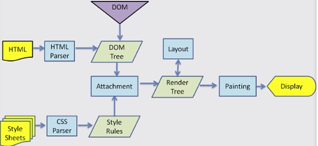
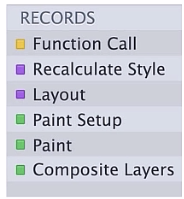
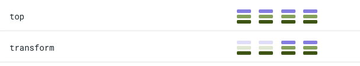
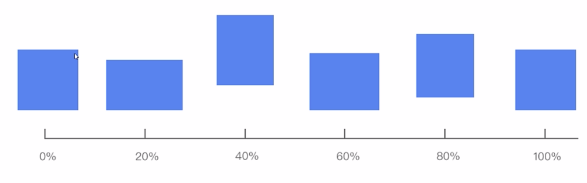
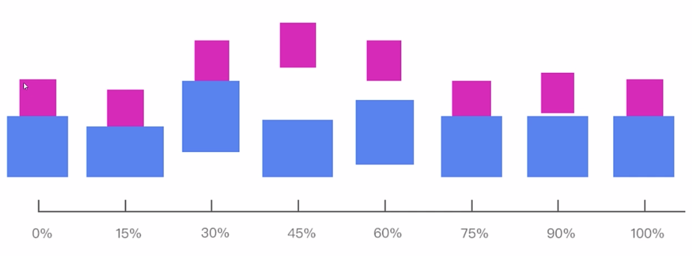

## 从渲染原理中看懂动画
### 动画如何产生的
我们要知道一次渲染就会形成一次位图，那么动画就需要形成多个位图，再对这些位图进行播放才能出现动画效果。

### 页面的渲染原理
可以看下面这种很经典的图回顾一下：


painting操作之后就会生成位图，最后一步会有一个合成操作即Composite，合成操作主要是将位图从CPU 丢到 GPU上 就可以显示在屏幕上，如上便完成一次完整的渲染过程，那么以上的过程在浏览器上都是有记录的如下：


- Function Call 记录着解析 html 和 css 过程
- recalculate Style 记录着 生成render tree的过程
- Layout 记录 layout的过程
- paint setup 和 paint 记录着 绘制的过程
- composite layers 记录 合成的过程

## 高性能动画
### 如何实现高性能动画
实现高性能动画需要知道以下3个页面渲染的阶段：layout、paint、composite这三个阶段。这三个阶段是比较耗费性能的，也是我们开发中需要重点关注的，不同的css属性值变化的时候是不一定非得经历layout、paint、composite这三个阶段的，有些只需要经历layout和composite阶段，有些甚至只需要经历composite阶段，所以我们需要了解css属性在新的一轮渲染时需要经历几个阶段。这我们要从何得知呢？我们可以借助 [cssTriggers](https://csstriggers.com/) 到上面去查看。页面内容如下：


如上图所示，对top属性进行修改每次都需要经历layout、paint、composite这三个阶段，所以用它来做动画性能就不是特别好，相比来说transform就要优秀一些，所以我们心里要有个概念。

### 实现高性能动画的方式

(1)、硬件加速（对GPU的使用率）

硬件加速也叫做GPU加速。GPU擅长对texture进行偏移、放大缩小、旋转等，并且GPU渲染时跳过layout，paint只触发Composite，速度极快。

那么问题来了，如何对GPU充分使用？回答这个问题之前，我们还需要了解Layer模型，一些的css属性能够为元素生成Layer，然后Layer会作为texture上传到GPU。综上，只要我为元素生成Layer那么在下一轮渲染中我就只会触发composite，也就是说新的位图直接在GPU上跑了，这就似的GPU得到充分使用了。

所以现在我们只需要知道如何为元素生成Layer，方法如下：

- 使用 3d 或 perspective、transform属性
- 使用animation，transition改变opacity，transform的元素
- video、canvas、flash、css filter等

(2)、requestAnimationFrame

一个流程的动画，一秒钟需要刷新60次（即 1/60FPS），约等于16.7ms内我们就需要把一帧的内容准备好，所以在一帧内需要完成一次渲染生成一张位图。如此一来我们才可以看到流畅的动画。

我们知道一帧内只能处理一张位图，所以当动画性能不好的情况下就会存在失帧的情况发生。现在来场景重现一下失帧的情况，某张位图未在16.7ms中准备好，呢么在下一个时间间隔内可能有两张位图形成，这时候由于一帧只能处理一张位图，所以多出来的位图就会被丢弃，这就是失帧的现象。那么要解决失帧的问题，我们就可以调节屏幕的刷新频率，比如一秒钟只刷新30次，那自动调节就是根据位图的渲染情况设置不同的刷新频率来实现不掉帧，要如何做到如下：

requestAnimationFrame(callBack);  回调函数中就是写我们的动画，具体使用如下：
```html
<body>
  <div id="box">
  </div>
  <script>
    var box = document.getElementById('box')
    requestAnimationFrame(function() {
      setInterval(function() {
        var top = parseInt(box.offsetTop)
        box.style.top = (top - 1) + 'px'
      })
    })
  </script>  
</body>
```
虽然这样能够保证不失帧，但是动画还是会存在不流程的情况，所以我们的终极目标还是要将每一帧的渲染都控制在16ms内，具体思路如下：
 - 是否能略过layout和paint这两个步骤，做动画的时候查一下[cssTriggers](https://csstriggers.com/)
  
 - 读取以下属性会引起layout
 ```js
 // 读取这些属性会引起layout
 // clientHeight，clientLeft，clientTop，clientWidth，focus(), 
 // getBoundingClinetReact(), getClientRects(), innerText, 
 // offsetHeight, offsetLeft, offsetRight, offsetHeight, offsetWidth ....
 // 错误做法
 var h1 = element1.clientHeight;
 element1.style.height = h1 + 2 + 'px';

  var h2 = element1.clientHeight;
 element2.style.height = h1 + 2 + 'px';

 // 正确做法，先读后写
 var h1 = element1.clientHeight;
 var h2 = element1.clientHeight;

 element1.style.height = h1 + 2 + 'px';
 element2.style.height = h1 + 2 + 'px';
 ``` 

 ## CSS 动画时间线
 面对一些较为复杂的动画怎么做到高度还原，这时候我们就要画一条时间线，记录一些关键时刻的动画状态，这就是CSS Time，如下：
 

 看懂Css Time后，接下来我们来实现更为复杂的动画，如下：
  
  注意每一个节点的动画都是以初始状态为改变基础的

```html
// 这里包含两个动画的 具体实现
<!DOCTYPE html>
<html lang="en">
<head>
  <meta charset="UTF-8">
  <meta http-equiv="X-UA-Compatible" content="IE=edge">
  <meta name="viewport" content="width=device-width, initial-scale=1.0">
  <title>Document</title>
  <style>
    .box {
      position: absolute;
      top: 40%;
      left: 40%;
      width: 300px;
      height: 300px;
      background: rgb(75, 131, 240);
      animation: jump 1s 0.3s  linear both infinite;
    }

    @keyframes jump{
      0% {transform: scale(1,1) translate(0, 0)}
      20% {transform: scale(1.13, 0.87) translate(0, 0)}
      40% {transform: scale(0.92, 1.08) translate(0, -40px)}
      60% {transform: scale(1.05, 0.95) translate(0, 0px)}
      80% {transform: scale(0.98, 1.02) translate(0, -20px)}
      100% {transform: scale(1, 1) translate(0, 0px)}
    }

    
    .block {
      display: flex;
      flex-direction: column;
      align-items: center;
      position: absolute;
      top: 50%;
      left: 50%;
      transform: translate(-50%, -50%);
    }
    .bottom_block {
      width: 200px;
      height: 200px;
      background: rgb(75, 131, 240);
      animation: bottom 1s 0.3s  linear both infinite;
    }
    .up_block {
      width: 100px;
      height: 100px;
      background: rgb(233, 52, 185);
      animation: up 1s 0.3s  linear both infinite;
    }

    @keyframes bottom{
      0% {transform: scale(1,1) translate(0, 0)}
      15% {transform: scale(1.13, 0.87) translate(0, 0)}
      30% {transform: scale(0.92, 1.08) translate(0, -40px)}
      45% {transform: scale(1.05, 0.95) translate(0, 0px)}
      60% {transform: scale(0.98, 1.02) translate(0, -20px)}
      75% {transform: scale(1, 1) translate(0, 0px)}
      100% {transform: scale(1, 1) translate(0, 0px)}
    }

    @keyframes up{
      0% {transform: scale(1,1) translate(0, 0)}
      15% {transform: scale(1,1) translate(0, 19px)}
      30% {transform: scale(0.98, 1.02) translate(0, -54px)}
      45% {transform: scale(0.96, 1.04) translate(0, -70px)}
      60% {transform: scale(0.98, 1.02) translate(0, -54px)}
      75% {transform: scale(1.02, 0.98) translate(0, 0)}
      90% {transform: scale(0.99, 1.01) translate(0, -5px)}
      100% {transform: scale(1, 1) translate(0, 0px)}
    }

    
  </style>
</head>
<body>
  <div class="box">
  </div>

  <!-- <div class="block">
    <div class="up_block">
    </div>
    <div class="bottom_block">
  </div> -->
</div>
</body>
</html>
```


