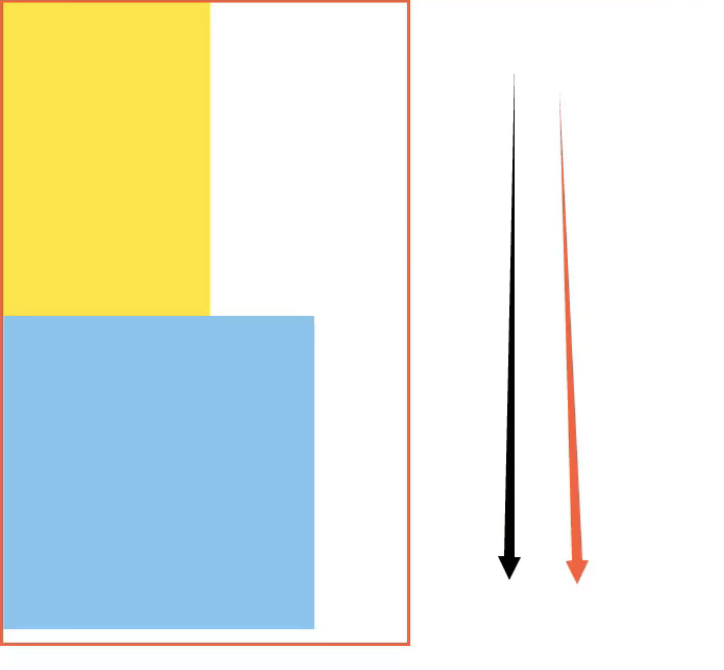
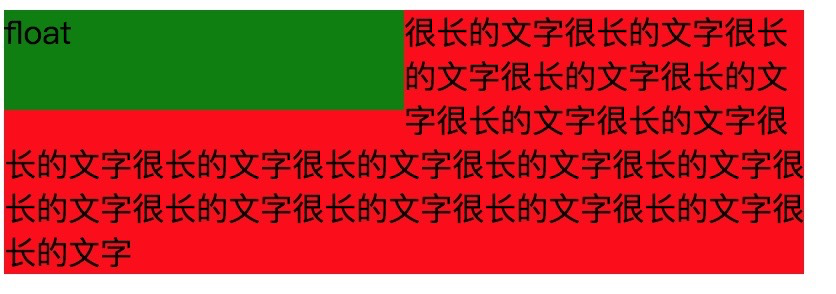
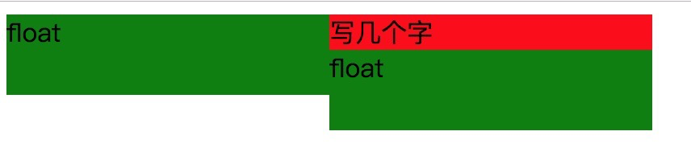
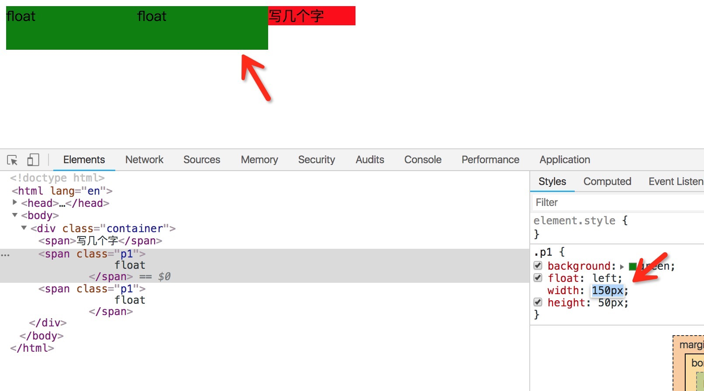
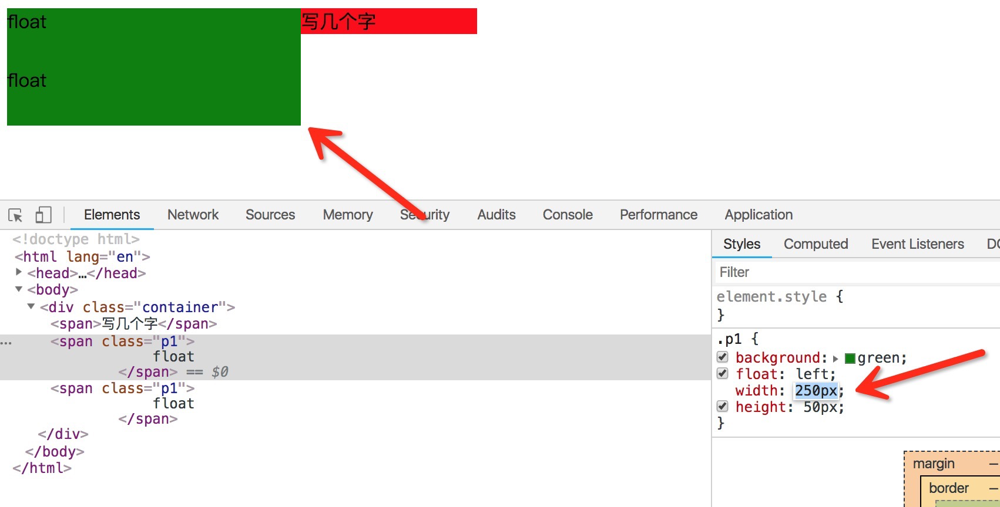
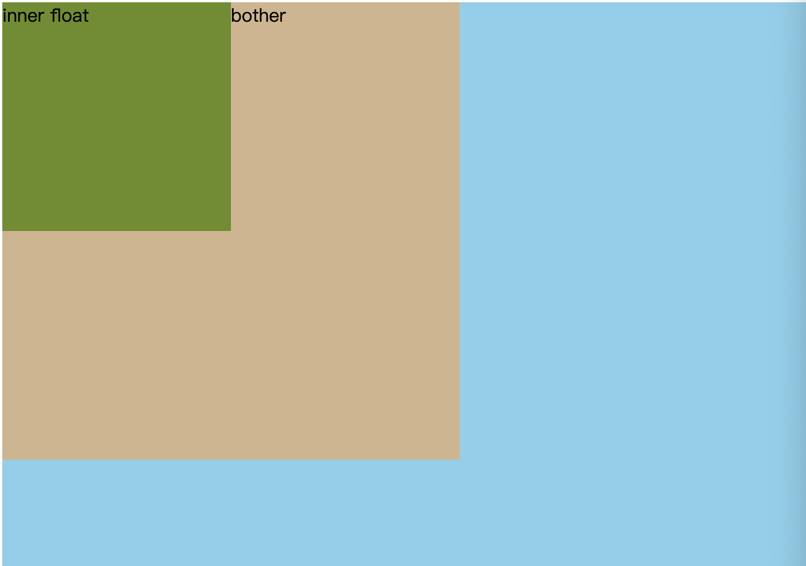
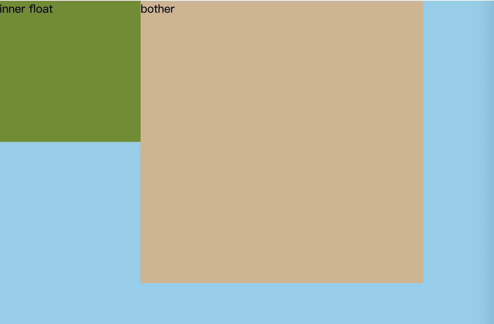

## 标准文档流
要学习float，我们首先要知道什么是标准文档流，标准文档流是指元素排版布局的过程中，元素会默认自动的从左到右，从上至下的流式排版方式。当前面内容发生了变化，后面的内容位置也会随着发生变化。HTML就是一种标准文档流文件。
如下例子：
```html
<!DOCTYPE html>
<html lang="en">
<head>
 <meta charset="UTF-8">
 <title>Document</title>
 <style>
  .box1 {
   width: 200px;
   height: 300px;
   background-color: yellow;
  }
  .box2 {
   width: 300px;
   height: 300px;
   background-color: skyblue;
  }
 </style>
</head>
<body>
 <div class="box1"></div>
 <div class="box2"></div>
</body>
</html>
```
呈现的效果如下：


现在如果我想要把box2（即蓝色块）移到和box1 并列，这时候我们就需要脱离文档流（脱离文档流的方式有绝对定位，浮动，固定定位）这里我们采取浮动。

## 脱离文档流
脱离文档流 也就是将元素从普通的布局排版中拿走，其他盒子在定位的时候，会当做脱离文档流的元素不存在而进行定位。需要注意的是，使用float脱离文档流时，其他盒子会无视这个元素，但其他盒子内的文本依然会为这个元素让出位置，环绕在周围，即脱离的文档流，但是不会脱离文本流（这个特点常用来实现图文混排）。
以下

## 浮动特性

### 特征一
float元素脱离文档流，但是不脱离文本流。

以下案例，帮助理解：
```html
<style>
　　.container{
　　　　background: red;
　　　　width: 400px;
　　}
　　.p1{
　　　　background: green;
　　　　float: left;
　　　　width: 200px;
　　　　height: 50px;
　　}
</style>
<body>
　　<div class="container">
　　　　<div class="p1">float</div>
　　　　<div class="p2">
　　　　　　很长的文字很长的文字很长的文字很长的文字很长的文字很长的文字很长的文字很长的文字很长的文字很长的文字很长的文字很长的文字很长的文字很长的文字很长的文字很长的文字很长的文字很长的文字
　　　　</div>
　　</div>
</body>
```

效果图中我们可以看出来，文字环绕的效果是很明显的，这里要注意一个地方：浮动虽然脱离了正常的文档流，但是还会占有正常文档流的文本空间，上图中，p2的区域已经跑到了p1的底下，因为float让p1脱离文档流，但是p2上的文字却没有顶过去，也就是说p2上的一部分文字的空间依然被p1占据着，所以从这里可以看出float的脱离文档流不是完全脱离。

### 特征二
- 对自身影响：形成块（BFC）当一个行内元素被设置浮动后，它就拥有了块级元素的特性了，比如可以设置宽高。
- 浮动元素位置会尽量向上靠。
- 浮动元素的位置会尽量向左靠。

在看一个案例：
```html
<style>
　　.container{
　　　　background: red;
　　　　width: 400px;
　　}
　　.p1{
　　　　background: green;
　　　　float: left;
　　　　width: 200px;
　　　　height: 50px;
　　}
</style>
<body>
　　<div class="container">
　　　　<span>写几个字</span>
　　　　<span class="p1">
　　　　　　float
　　　　</span>
　　　　<span class="p1">
　　　　　　float
　　　　</span>
　　</div>
</body>
```

我们来解释一下为什么会出现上图的效果，第一个类为“p1”的元素左侧的空间富裕所以它会尽可能的往左上角跑，所以跑到了左上角位置。第二个类为“p1”的元素，也会尽量往左上角跑，但是`<span>写几个字</span>` 也有占据空间，而剩下的空间并不能支持第二个类为“p1”的元素再向上跑了所以成这个样子。

如果类“p1”元素的宽度加起来小于 400 减去`写几个字的长度`，则第二个元素就能再网上移动。效果如下：


如果类“p1”元素的宽度加起来大于400，那么第二个p1元素就会往下掉，效果如下：


### 特征三：对父级元素的影响
   1. 当包含元素中只有浮动元素时，父元素高度会塌陷。
   2. 浮动元素的父元素之后的非浮动兄弟元素，忽视浮动元素存在，覆盖浮动元素的位置。
   ```html
    <style>
      .first {
        height: 500px;
        background-color: skyblue;
      }
      .second {
        width: 400px;
        height: 400px;
        background-color: tan;
      }
      .float {
        float: left;
        width: 200px;
        height: 200px;
        background-color: olivedrab;
      }
    </style>

    <body>
    <div class="first">
      <div>
          <div class="float">inner float</div>
      </div>  
      <div class="second">bother</div>    
    </div> 
    </body>
    </html>
   ```
   效果如下：
   
   3. 浮动元素的父元素之后的浮动兄弟元素，会跟随浮动元素布局，仿佛处在同一父元素中。
   ```html
   <style>
      .first {
        height: 500px;
        background-color: skyblue;
      }
      .second {
        float: left;
        width: 400px;
        height: 400px;
        background-color: tan;
      }
      .float {
        float: left;
        width: 200px;
        height: 200px;
        background-color: olivedrab;
      }
    </style>

    <body>
    <div class="first">
      <div>
          <div class="float">inner float</div>
      </div>  
      <div class="second">bother</div>    
    </div> 
    </body>
    </html>
   ```
   效果如下：
   

### 特征四：对兄弟级元素的影响
   1. 浮动元素后面跟非浮动元素，那么浮动元素的位置会被非浮动元素占据，浮动元素覆盖在非浮动元素之上，非浮动元素的文字或者其他行内元素会环绕浮动元素。
   2. 浮动元素前后的行内元素环绕浮动元素。
   3. 浮动元素临近元素也是浮动元素，且方向相同，会并排显示，当宽度大于父元素宽度是会换行排列。
   4. 浮动元素之间的水平外边距不会叠加(不管有没有清除浮动)


## 常见的float布局

### 两栏布局

(1)、 float: left + margin-left（如果侧边栏在右侧 就改为float:right + margin-right）
```html
<style>
  div {
    height: 500px;
  }
  .aside {
    width: 300px;
    float: left;
    background: yellow;
  }
  .main {
    background: aqua;
    margin-left: 300px;
  }
</style>
</head>
<body>
  <div class="aside"></div>
  <div class="main"></div>
</body>
```

(2)、 float + BFC
```html
<style>
  div {
    height: 500px;
  }

  .aside {
    width: 300px;
    float: left;
    background: yellow;
  }

  .main {
    overflow: hidden;
    background: aqua;
  }
</style>
</head>
<body>
  <div class="aside"></div>
  <div class="main"></div>
</body>
```

(3)、 float + margin-right 负值
```html
<style>
 .left {
   width: 100%;
   float: left;
   background: #f00;
   margin-right: -200px;
 }

 .right {
   float: left;
   width: 200px;
   background: #0f0;
 }
</style>
</head>
<body>
  <div class="left">hello</div>
  <div class="right">world</div>
</body>
```
(4)、 float + margin-left 负值
```html
<style>
 div {
   height: 100%;
 }

 .left {
   float: left;
   width: 100%;
   background: #0f0;
 }

 .right {
   float: left;
   width: 300px;
   margin-left: -300px;
   background: #00f;
 }
</style>
</head>
<body>
  <div class="left">hello</div>
  <div class="right">world</div>
</body>
```

### 三栏布局

(1)、 圣杯布局
```html
<!DOCTYPE html>
<html lang="en">
 <head>
   <meta charset="UTF-8">
   <style>
     .container {
       padding: 0 200px 0 200px;
     }
     .header {
       height: 40px;
       line-height: 40px;
       background-color: antiquewhite;
     }
     .footer {
       height: 40px;
       line-height: 40px;
       background-color: brown;
     }
     .center, .left, .right {
       height: 400px;
       float: left;
     }
     .center {
       width: 100%;
       background-color: cadetblue;
     }
     .left {
       width: 200px;
       background-color: darkcyan;
       margin-left: -100%;
       position: relative;
       left: -200px;
     }
     .right {
       width: 200px;
       background-color: darkkhaki;
       margin-right: -200px;
     }
     .clearfix:after {
       content: '';
       display: table;
       clear: both;
     }
   </style>
 </head>
 <body>
   <div class="header">this is header</div>
   <div class="container clearfix">
     <div class="center">this is center</div>
     <div class="left">this is left</div>
     <div class="right">this is right</div>
   </div>
   <div class="footer">this is footer</div>
 </body>
</html>
```

(3)、双飞翼布局
```html
<!DOCTYPE html>
<html lang="en">
 <head>
   <meta charset="UTF-8">
   <style>
     .header {
       height: 40px;
       line-height: 40px;
       background-color: darkkhaki;
     }
     .footer {
       height: 40px;
       line-height: 40px;
       background-color: darkolivegreen;
     }
     .container {
       overflow: hidden;
     }
     .center {
       float: left;
       width: 100%;
     }
     .center-wrap {
       height: 400px;
       margin: 0 200px 0 200px;
       background-color: darkslategray;
     }
     .left {
       width: 200px;
       height: 400px;
       background-color: darkviolet;
       margin-left: -100%;
     }
     .right {
       width: 200px;
       height: 400px;
       background-color: dodgerblue;
       margin-left: -200px;
     }
     .left, .right {
       float: left;
     }
   </style>
 </head>
 <body>
   <div class="header">this is header</div>
   <div class="container">
     <div class="center">
       <div class="center-wrap">this is center</div>
     </div>
     <div class="left">this is left</div>
     <div class="right">this is right</div>
   </div>
   <div class="footer">this is footer</div>
 </body>
</html>
```