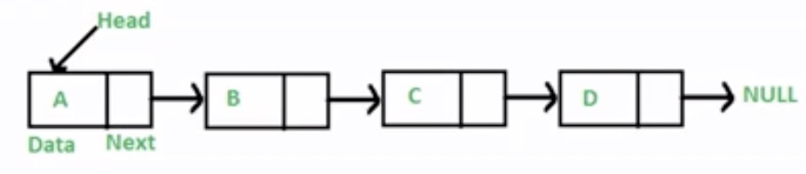
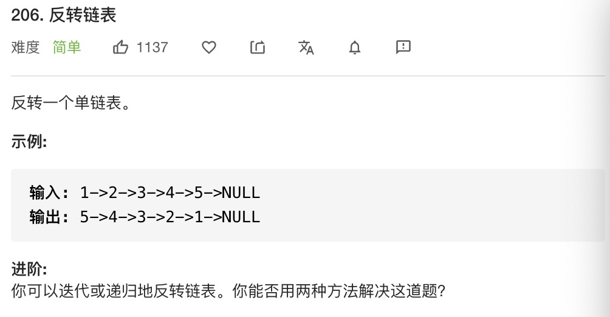

## 链表是什么
链表是由多个元素组成的列表，元素储存是不连续的，元素和元素之间使用next指针连在一起的。

如下图所示，abcd这四个元素，用next指针连在一起：


同样可以用来表示列表的数组和链表有什么区别呢？

- 数组：增删非首尾元素时往往需要移动元素
- 链表：增删非首尾元素，不需要移动移动元素，只需要改变next指向就可以了

### JS中链表如何表示
js中是没有链表这个数据结构的。但是我们可以用Object来模拟链表。如下：

```js
const a = { val: 'a' };
const b = { val: 'b' };
const c = { val: 'c' };
const d = { val: 'd' };
a.next = b;
b.next = c;
c.next = d; // 这样就实现了一个链表

// 遍历链表(遍历算法)
let p = a; // 声明一个指针指向a
while(p) {
    console.log(p.val);
    p = p.next;
}

// 链表中插入值
const e = { val: 'e'; };
c.next = e;
e.next = d; // 这样我们就在c和d之间插入e

//  删除
c.next = d;// 改变c的指向，就可以把e删掉
```

### JS中的原型链
看到上面JS模拟链表的例子，我们是不是感觉非常的熟悉，是不是想到了JS中的原型链就是链表的数据结构。原型链上的节点是各种原型对象，比如：Function.prototype,Object.prototype...，原型链通过__proto__属性链接各种原型对象 （我们之前demo中的链表使用next来链接的而原型链中使用proto来链接的）。

回顾一下原型链是长什么样的，加深一下印象：

1. new Object() --__proto__--> Object.prototype --__proto__--> null
2. new Function() --__proto__ --> Function.prototype --__proto__--> Object.prototype --__proto__ --> null
3. new Array() --__proto__ --> Array.prototype --__proto__ --> Object.prototype --__proto__ --> null

#### instanceof 的原理
其实 instanceof 操作符的原理就是链表，因为假如 A instanceof B 是true的话，那么 A沿着原型链就能找到 B.prototype。

看一下具体实现吧：
```js
function instanceof (A, B) {
  var P = A
  while (P) {
    if (P === B.prototype) {
      return true
    }
    P = A.__proto__
  }
  return false
}
```

## leetcode 刷题

### leetcode 206


```js
var reverseList = function (head) {
  var pre = null
  var cur = head
  var temp
  while (cur) {
    temp = cur.next
    cur.next = pre
    pre = cur
    cur = temp
  }
  return pre
}
```


