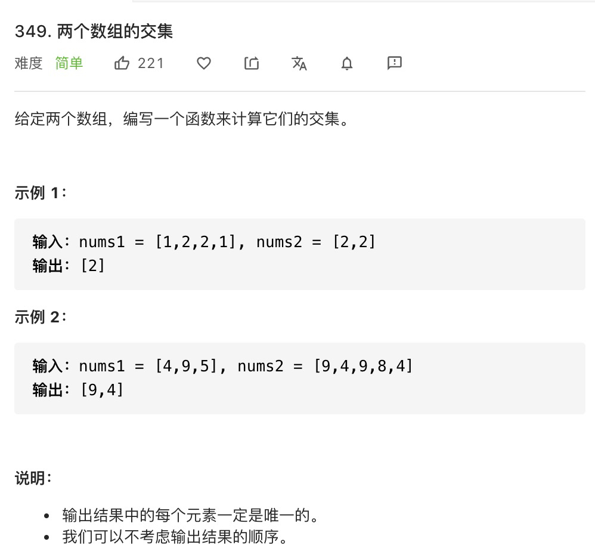
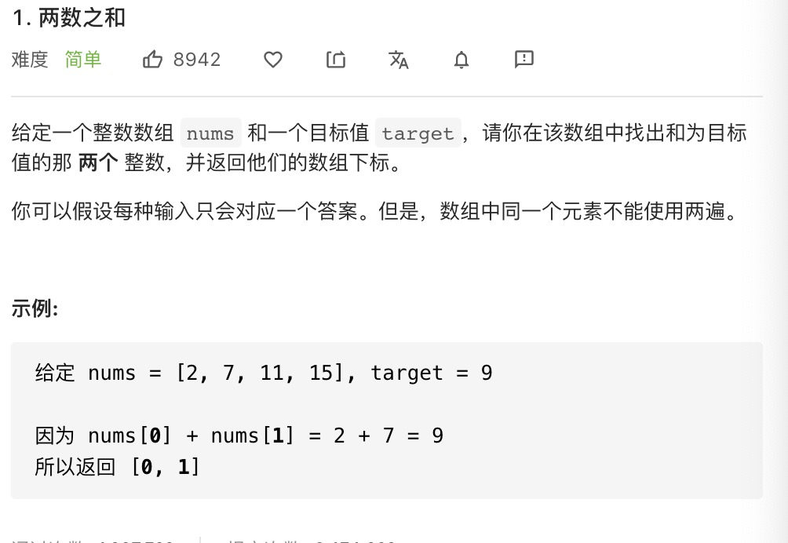

## 字典是什么
字典和集合类似，字典也是一种存储唯一值的数据结构，但它是以键值对的形式来存储。Es6中就有字典，名为Map。常用的操作有键值对的增删改查。

### js中集合的使用
```js
const m = new Map();

// 增
m.set('a', 'aa');
m.set('b', 'bb');
// 查
m.get('a'); // aa

// 删
m.delete('b');
m.clear(); // 删除所有的键值对

//改
m.set('a', 'aaa'); // 再次覆盖
```

## leetcode 刷题

### leetcode 349

```js
var intersection = function(nums1, nums2) {
  const map = new Map();
  nums1.forEach(n => {
    map.set(n, true);
  });
  const res = [];
  nums2.forEach(n => {
      if (map.get(n)) {
           res.push(n);
          map.delete(n);
      }
  });
  return res;
};
```

### leetcode 20
有效括号用字典的方案完成

```js
var isValid = function (s) {
    if (s.length % 2 === 1) return false;
    const map = new Map()
    const stack = [];
    map.set('(', ')');
    map.set('{', '}');
    map.set('[', ']');
    for(let i = 0; i < s.length; i++) {
    const c = s[i];
    if (map.has(c)) {
      stack.push(c);
    } else {
      const t = stack[stack.length - 1];
      if (map.get(t) === c) {
        stack.pop();
      } else {
        return false;
      }
    }
  }
}

```

### leetcode 1

```js
var twoSum = function(nums, target) {
    const map = new Map();
    for (let i = 0; i < nums.length; i++) {
        if (map.has(nums[i])) { // 如果找到值和 字典的key相等的时候就证明有相加为target的值
            return [map.get(nums[i]), i];
        } else {
            map.set(target - nums[i], i); // 相减后作为map的key i为value
        }
    }
};
```

