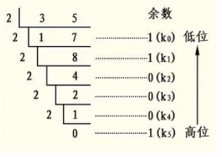

## 栈是什么
栈其实就是一个先进后出的一个数据结构，js中没有栈，但是可以用array来实现栈的所有功能。

## 栈的应用场景
需要先进后出的场景。比如，十进制转二进制、判断字符串是否是有效字符、函数调用堆栈
1. 场景一（十进制转二进制）
   
  

  出来的余数反而要排到最前面，把余数依次，这就是典型的栈。

2. 场景二（有效括号）
   ```js
   ((((())))) 合法
   ()()()合法
   ((()() 不合法
   ```
   越靠后的左括号，对应的右括号就越靠前。根据这一点遍历字符串，遇到左括号入栈，遇到右括号出栈，如果遍历结束，栈还有数据则不合法，如果栈为空就合法。

3. 场景三（函数的调用栈）
   ```js
   function a() {
     b()
   }
   function b() {
    console.log(b)
   }
   a()
   ```
   我们可以发现b函数先执行完，这和栈的先近后出，后进先出的特点如出一辙。

## leetcode 刷题
### leetcode-20 有效括号
```js
var isVaild = function (str) {
  var length = str.length
  var stack = []
  if (length%2) return false
  for (var i = 0; i < length - 1; i++) {
    var s = str[i]
    switch (s) {
      case '(':
       stack.push(s)
       break;
      case '[':
        stack.push(s)
        break
      case '{':
        stack.push(s)
        break
      case ')':
        if (stack.pop() !== '(') return false
        break
      case ']':
        if (stack.pop() !== '[') return false
        break
      case '}':
        if (stack.pop() !== '{') return false
        break       
    }
  }
  return !stack.length
}
```

### leetcode-144 二叉树前序遍历 （非递归版）

```js
var preorderTraversal = function(root) {
  var result = []
  var stack = []
  if (root) stack.push(root)
  while(stack.length) {
    var n = stack.pop()
    result.push(n.val)
    if (n.right) stack.push(n.right)
    if (n.left) stack.push(n.left)
  }
  return result
}
```


