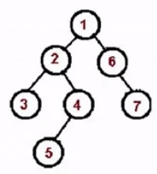
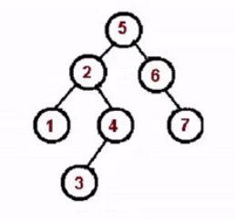
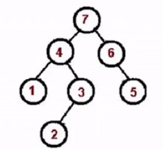

## 什么是树
树它是由n个有限节点组合成的一个有层次感的集合。在js中我们通常用Object来表示树这种数据结构。

### js中如何表示树
```js
const tree = {
    val: 'a',
    children: [ 
        {
            val: 'b',
            children: [
                {val: 'd', children: [
                   { val: '9', 
                      children:[
                       {val: '11'}
                       ] }, {val: '10'}]},
                { val: 'e', children: [{ val: '5' }] }
            ]
        },
        {
            val: 'c',
            children: [
                {val: 'f'},
                { val: 'g' }
            ]
        },

    ]
}
```

## 深度与广度优先遍历
深度优先遍历是尽可能深地遍历分支，而广度优先遍历是先访问离根节点更近的节点。

### 深度优先遍历
深度优先遍历的诀窍是递归（先访问根节点，再对根节点的children挨个进行深度优先遍历）

```js
const tree = {
    val: 'a',
    children: [ 
        {
            val: 'b',
            children: [
                {val: 'd', children: [
                   { val: '9', 
                      children:[
                       {val: '11'}
                       ] }, {val: '10'}]},
                { val: 'e', children: [{ val: '5' }] }
            ]
        },
        {
            val: 'c',
            children: [
                {val: 'f'},
                { val: 'g' }
            ]
        },

    ]
}

const dfs = (root) => {
    console.log(root.val, root.children);
    if (!root.children) return;
    root.children.forEach((child) => {
      dfs(child);  
    })
}
```

### 广度优先遍历
广度优先遍历的思路如下(利用队列的先进先出原理)：

1. 新建一个队列，把根节点入队
2. 把队头出队并进行访问
3. 队头的children挨个入队
4. 重复 2，3 两步，直到队列为空

```js
const tree = {
    val: 'a',
    children: [
        {
            val: 'b',
            children: [
                {val: 'd'},
                { val: 'e' }
            ]
        },
        {
            val: 'c',
            children: [
                {val: 'f'},
                { val: 'g' }
            ]
        },

    ]
}
const bfs = (root) => {
    const q = [root];
    while(q.length > 0) {
        const n = q.shift();
        console.log(n.val);
        if (!n.children) return;
        n.children.forEach((child) => {
          q.push(child);
        })
    }
}
```

## 二叉树
二叉树是每个节点最多只能有两个子节点。用js来模拟Object二叉树如下：

```js
const binaryTree = {
    val: 1,
    left: {
        val: 2,
        left: null
    },
    right: {
        val: 3,
        left: null
    }
}
```
### 遍历二叉树的方法
遍历二叉树的方案有先序，中序，后序遍历。下面让我来一一道来。

#### 先序遍历
先序遍历的口诀如下：

1. 访问根节点
2. 对根节点的左子树进行先序遍历
3. 对根节点的右子树进行先序遍历



```js
const bt = {
    val: 1,
    left: {
        val: 2,
        left: {
            val: 4,
            left: null,
            right: null
        },
        right: {
            val: 5,
            left: null,
            right: null
        }
    },
    right: {
        val: 3,
        left: {
            val: 6,
            left: null,
            right: null
        },
        right: {
            val: 7,
            left: null,
            right: null
        }
    }
}
const preorder = (root) => {
    if (!root) return;
    console.log(root.val);
    preorder(root.left);
    preorder(root.right);
}
```
非递归版本

```js
const preorder = (root) => {
    if (!root) return;
    const stack = [root];
    while(stack.lenght) {
      const n = stack.pop();
      console.log(n.val);
      if (n.right) stack.push(n.right);
      if (n.left) stack.push(n.left);
    }
}
```

#### 中序遍历

中序遍历的口诀如下：
1. 对根节点的左子树进行中序遍历
2. 访问根节点
3. 对根节点的右子树进行中序遍历



```js
const bt = {
    val: 1,
    left: {
        val: 2,
        left: {
            val: 4,
            left: null,
            right: null
        },
        right: {
            val: 5,
            left: null,
            right: null
        }
    },
    right: {
        val: 3,
        left: {
            val: 6,
            left: null,
            right: null
        },
        right: {
            val: 7,
            left: null,
            right: null
        }
    }
}
const inorder = (root) => {
    if (!root) return;
    inorder(root.left);
    console.log(root.val);
    inorder(root.right);
}
```

非递归版本：

```js
const inorder = (root) => {
    if (!root) return;
    const stack = [];
    let p = root;
    while (stack.lenght || p) {
       while(p) {
          stack.push(p);
          p = p.left;
       }
       const n = stack.pop();
       console.log(n.val);
       p = n.right; 
    }
}
```

#### 后序遍历
后序遍历的口诀如下：

1. 对根节点的左子树进行后序遍历
2. 对根节点的右子树进行后序遍历
3. 访问根节点



```js
const bt = {
    val: 1,
    left: {
        val: 2,
        left: {
            val: 4,
            left: null,
            right: null
        },
        right: {
            val: 5,
            left: null,
            right: null
        }
    },
    right: {
        val: 3,
        left: {
            val: 6,
            left: null,
            right: null
        },
        right: {
            val: 7,
            left: null,
            right: null
        }
    }
}
const postorder = (root) => {
    if (!root) return;
    postorder(root.left);
    postorder(root.right);
    console.log(root.val);
}
```

非递归版本（会比较难理解，我是这么理解的把先序遍历的结果倒着输出就可以，但有些差别，先序遍历是根左右的访问方式，而后序是左右根，所以我们需要对先序遍历进行微调（用栈思维先进后出），将先序遍历改为根右左，然后将结果倒序输出就是后序遍历）

```js
const postorder = (root) => {
    if (!root) retutn;
    const outputStack = [];
    const stack = [root];
    while(stack.lenght) {
      const n = stack.pop();
      outputStack.push(n);
      if (n.left) stack.push(n.left);
      if (n.right) stack.push(n.right);
    }
    while(outputStack.length) {
        const n = outputStack.pop();
        console.log(n.val);
    }
}
```
