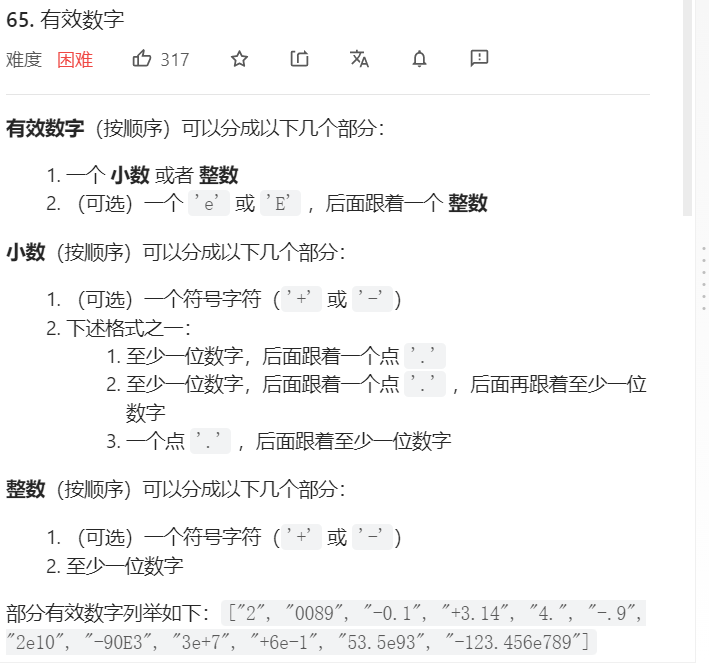
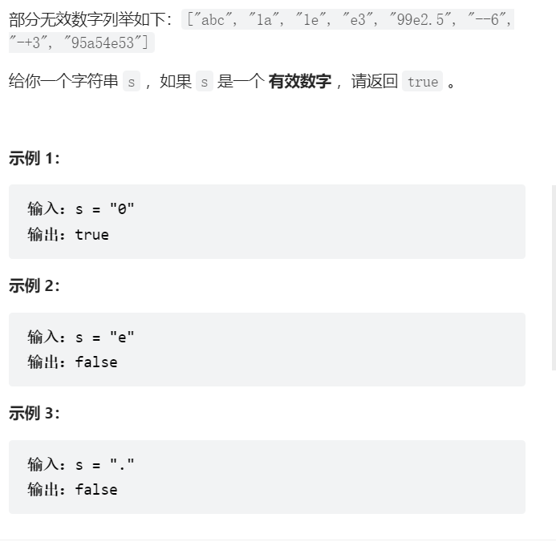
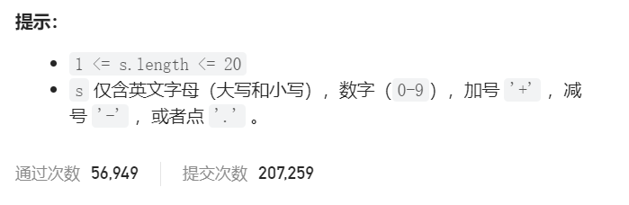
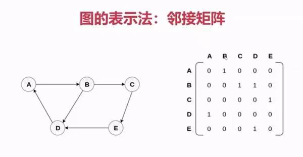
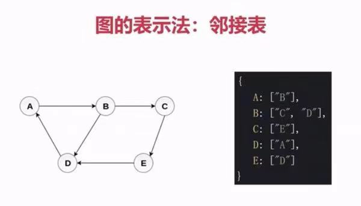
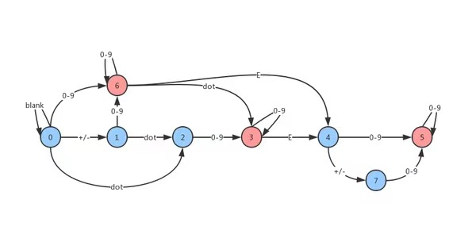

## 有效数字题目





### 解法一（正则）
```js
/**
 * @param {string} s
 * @return {boolean}
 */
var isNumber = function(s) {
  s = s.trim();  
  reg=/^[+-]?([0-9]+\.?[0-9]*|\.[0-9]+)([eE][+-]?[0-9]+)?$/g;
  return reg.test(s);
};
```


### 解法二 (使用 图 这个数据结构)
#### 图是什么
1. 图是网络结构的抽象模型，是一组由边连接的节点
2. 图可以表示任何二元关系，比如道路，航班等
3. js中没有图这个数据结构，但是我们可以使用Object和Array构建图
4. 图的表示法：邻接矩阵，邻接表，关联矩阵等



#### 思路
遍历字符串，不断转换状态，看最后的状态是否是有效状态

#### 时间复杂度
时间复杂度O(n), n是字符串长度，遍历了n次，所以时间复杂度是O(n)

空间复杂度O(1)

#### 根据题目画的图



#### 上代码

```js
var isNumber = function(s) {
    const graph = {//点和边构成的临接表
        0:{ 'blank': 0, 'sign': 1, '.': 2, 'digit': 6 },
        1:{ 'digit': 6, '.': 2 },
        2:{ 'digit': 3 },
        3:{ 'digit': 3, 'e': 4 },
        4:{ 'digit': 5, 'sign': 7 },
        5:{ 'digit': 5 },
        6:{ 'digit': 6, '.': 3,  'e': 4 },
        7:{ 'digit': 5 },
    }

    let state = 0// 初始状态

    for (let c of s.trim()) {// 循环字符串
        if (c >= '0' && c <= '9') {
            c = 'digit'
        } else if (c === ' ') {
            c = 'blank'
        } else if(c === '+' ||  c === '-') {
            c = 'sign'
        }

        state = graph[state][c]// 返回下一个状态

        if (state === undefined) {// 状态转移之后不在临接表中 返回false
            return false;
        }

    }
    
    if (state == 3 || state == 5 || state == 6) {//状态是3、5、6中的一个说明是有效数字
        return true;
    }

    return false;
};
```


