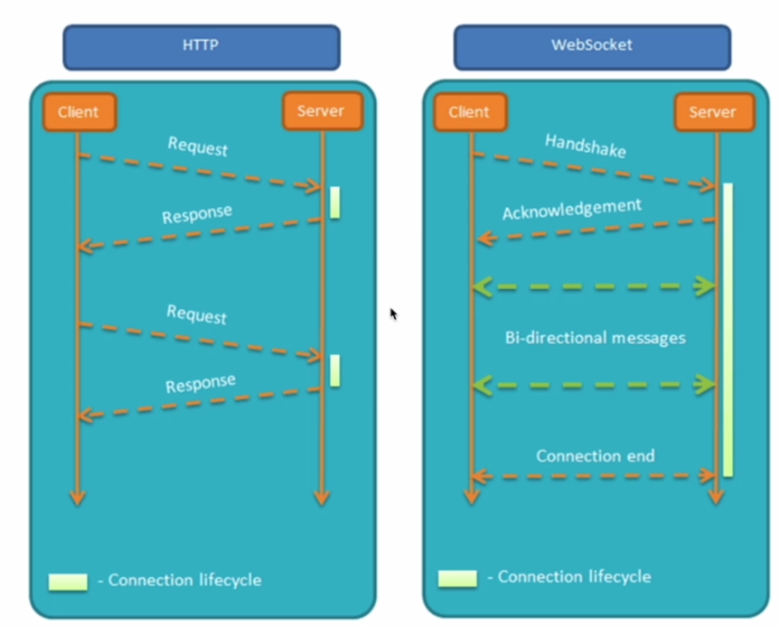

## 什么是websocket？
首先我们先看一下以下面图片：

### HTTP
我们拿http和websocket协议做个对比。HTTP 和 WebSocket 都是有 客户端和服务端的。首先说一下HTTP，HTTP的客户端就是浏览器一侧，客户端发送一个请求给服务端，服务端收到请求后上图的`Request` 和 `Response` 之间的白块代表的是服务端的处理逻辑或操作数据库的时间，由于http是无状态的，所以所有的请求都会包裹在request上，因此会话的状态都会保存在客户端上，所以服务端想主动向客户端发送消息是不可能的（http2先不考虑），只有客户端发送请求服务端再进行响应，假如现在我有个场景（我现在需要做一个消息提醒，通过传统轮询的方法，每隔一段时间就发起一个请求，这样会有时间差的情况出现，会造成网络资源和系统资源的浪费）。

### WebSocket
那么在HTML5中新增了websocket协议（优点：节省了服务器资源和带宽，并且能够更好的实时通讯）。如上图所示，客户端会跟服务端进行一次握手（Handshake），握手建立后客户端就和服务端建立了一个长链接，如此一来客户端和服务端就可以互相通信。（tip：websocket的长链接只是建立，并没有对数据库进行处理，所以不会有服务器资源的浪费；至于带宽如果没有通信需要是不会发送请求的，所以也不会造成带宽的浪费）

话说回来，什么是websocket？websocket是一种网络传输协议，可以在单个TCP连接上进行`全双工`通信，位于OSI模型的应用层，特点如下：

- TCP链接，与HTTP协议兼容
- 双向通信，主动推送（服务端向客户端）
- 无同源限制，协议标识符是ws（加密wss）

websocket的应用场景：
- 聊天、消息、点赞
- 直播评论（弹幕）
- 游戏、协同编辑、基于位置的应用

