## 配置前的一些基本要求
1. 确认Jenkins已经安装Github插件
2. Jenkins服务器已经拥有一个公网IP地址，我自己是在自己云服务器上搭建的

## 配置Jenkins获取Github的读取权
1. Github 需要生成一个访问token值，供Jenkins使用，生成token的方式如下：
   
   设置路径`Settings/Developer settings/Personal access tokens` 然后会进入以下页面，然后根据下图进行配置(token过期时间根据自己需要设置)：
   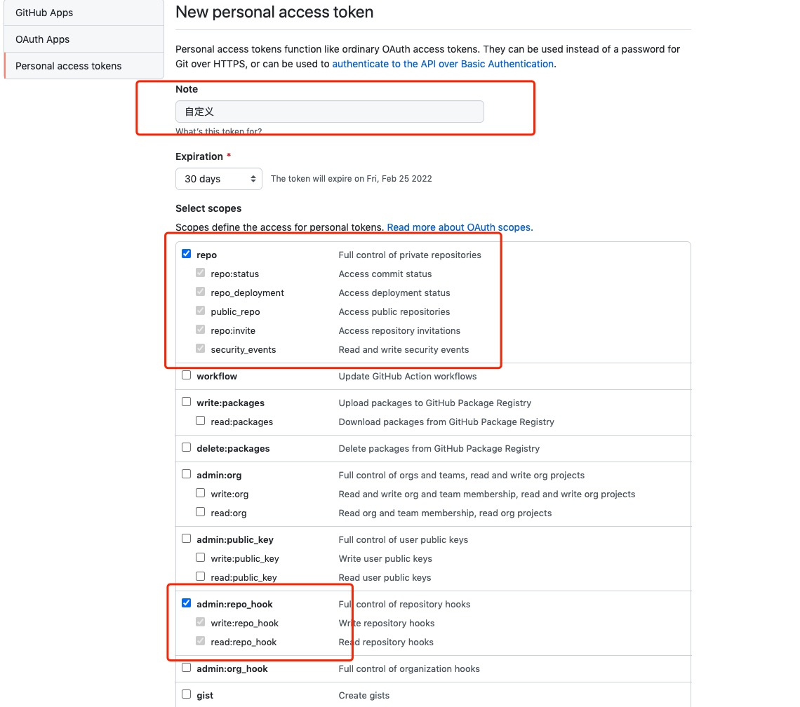

   创建成功后，token如下：
   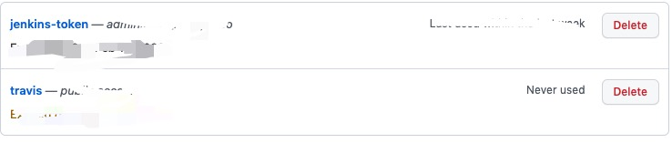

2. 第二步就需要到Jenkins中的Github中添加token凭证了
   
   设置路径 `系统管理 ——> 找到Github server ——> 添加Secret text凭证 ——> 链接测试`

   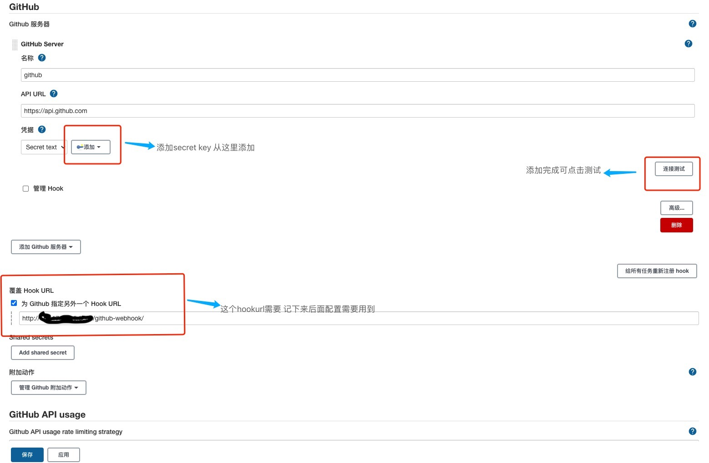

   添加凭证Secret text
   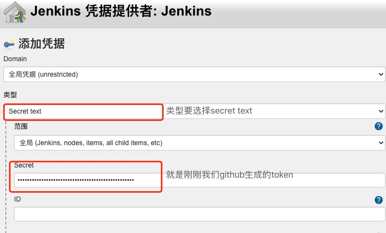

## Github中项目配置webhook

1. Github中项目配置webhook
   
   设置路径`进入需要自动化的仓库 ——> settings ——> Webhooks`

   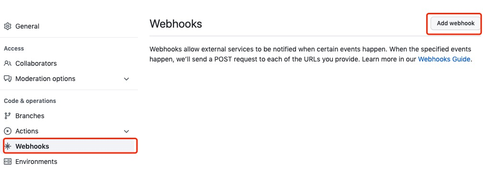

   点击add webhook按钮，将我们 刚刚在jenkins中的web hooks复制进去，即可
   
## jenkins中创建任务

1. 点击创建任务
   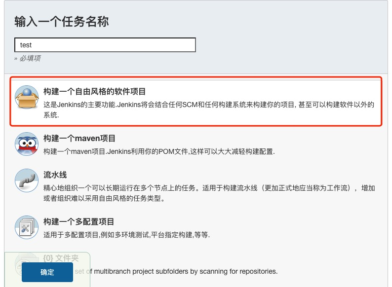
2. 任务中的配置项配置如下
   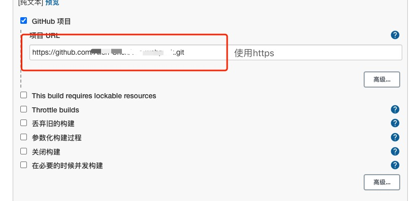
   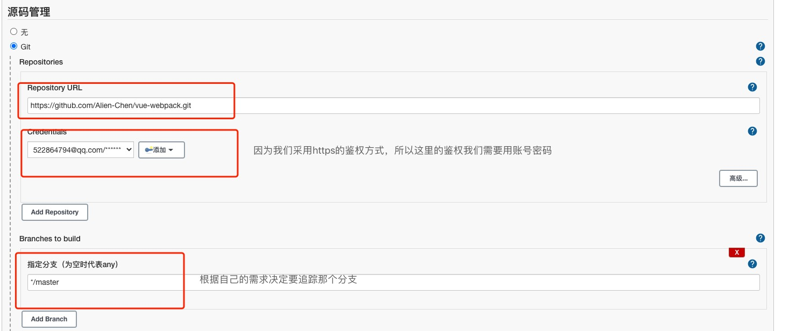
   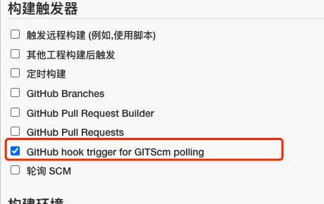
   
   点击确认即可完成配置
   1. 源码管理的credentials配置，如下：
   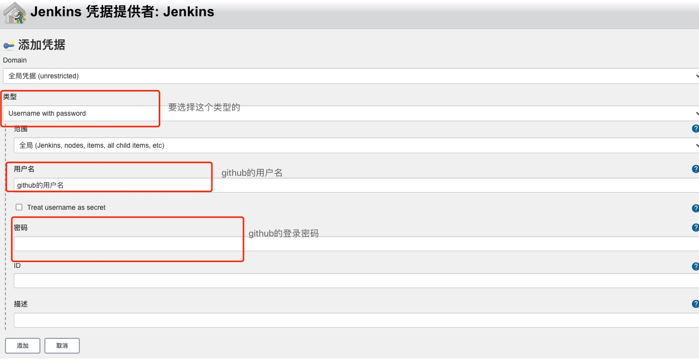
3. 添加我们项目需要执行的shell脚本
   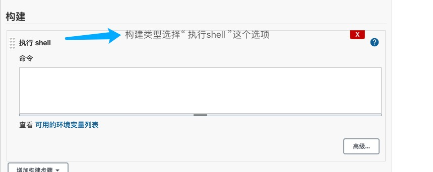
   ```shell
   // 脚本需要根据自己的项目的需求来编写，这里就不展开讲了哈
   echo 'hello word'
   ```
5. 到这里就大功告成了，现在我们可以愉快的提交代码，然后jenkins就会自动帮助我们执行我们脚本内容。


