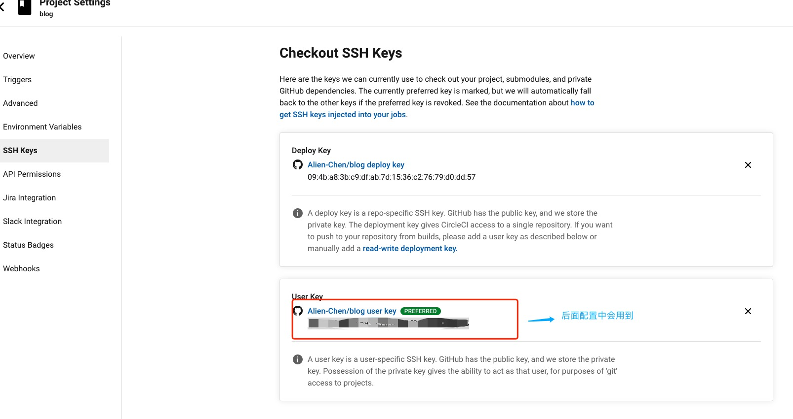

## Circle CI 的使用

1. 注册，[官网地址](https://app.circleci.com),进入到页面后点击Sign Up 按钮，选择Sign up with Github 进行github的授权登录，根据指引完成登录，登录后我们就可以看到我们github账号中的所有仓库了。

2. 接下来就是，我们需要在github中创建一个新的仓库 或者 你已经有了现成的仓库可以忽略掉这一步。
   
3. 将我们需要配置自动化的仓库同步到本地后，我们需要在项目根目录下创建一个.circle文件夹，文件夹下需要创建一个config.yml,以下提供了我的配置供大家参考（配置中的fingerprints，后面会讲如何获取到这个key）：
   ```shell
   version: 2
   jobs:
    build:
        docker:
        - image: circleci/node:10
        steps:
        - run: echo "A first hello"
        - run: npm -v

   ```

4. 将我们所添加的.circle 相关的代码提交到远程仓库去
   
5. 现在我们进入到Circle的管理后台我们就可以看到多出了一个我们刚刚提交的项目如下（以我的blog项目为例子）：
   
6. 点击 set Up Project，会询问你是否有配置config.yml文件，如果没有可以选择它提供的默认配置，这里因为我们已经在先前配置了config.yml文件了，所以我们选择用自己的配置，如下：
   
7. 经过上一步circle会帮我们自动build一次，如下：
    
8. 因为涉及到circle需要去远程仓库拉取代码，所以我们需要设置ssh密钥，点击项目面板右侧的`Project Settings`里面点击SSH Keys侧边栏选项，进入SSH keys配置页后，点击`Authorize with Github`，再回来点击 `Add User Key`，就会形成Deploy Key，如下：
   
   创建 Deploy Key的作用是可以让Circle直接访问Github仓库，防止没有权限读写的情况
9.  添加完成需要开始编写config.yml:
    ```shell
    version: 2
    jobs:
      build:
        docker:
        - image: circleci/node:10
        branches:
        only:
            - master
        steps:
        - add_ssh_keys:
            fingerprints:
                - 'xxxxxxxxxxxxxxxxxxxxxxxxxxxxxxxxxxx'# 这个自己生成
        - checkout
        - restore_cache: # 使用 node_modules的缓存
            keys:
                - dependencies_blog
        - run: echo "A first hello"
        - run: npm -v
        - run:
            name: Install
            command: yarn install
        - save_cache: # 这一步是为了对node_module进行缓存，避免每次构建都重新下载依赖
            paths:
                - node_modules
            key: dependencies_blog
        - run:
            name: Build
            command: yarn docs:build
        - run:
            name: grant authority
            # 赋予执行权限 shell chmod +x
            # 执行shell脚本
            command: chmod +x scripts/deploy.sh
        - run: # 执行 将dist目录提交到 gh_pages 分支的脚本
            name: deloy github
            command: ./scripts/deploy.sh
    ```
10. 在项目根目录下创建一个scripts文件夹，文件夹下创建一个deploy.sh 我们来编写脚本
    ```shell
    # $XXX 为全局变量 等下需要配置
    # 告诉linux这个是个shell脚本
    #!/bin/sh

    # 如果没有结束到一个非0的数值的话就推出shell脚本的执行
    set -e

    # 打印当前的工作路径
    pwd
    remote=$(git config remote.origin.url)

    echo 'remote is: '$remote

    # 新建一个发布目录
    mkdir gh-pages-branch
    cd gh-pages-branch
    # 创建一个新的仓库
    # 设置发布的用户与邮箱
    git config --global user.email "$GH_EMAIL" >/dev/null 2>&1

    git config --global user.name "$GH_NAME" >/dev/null 2>&1

    git init
    git remote add --fetch origin "$remote"

    echo 'email is: '$GH_EMAIL
    echo 'name is: '$GH_NAME
    echo 'sitesource is: '$siteSource

    # 切换gh-pages分支
    if git rev-parse --verify origin/gh-pages >/dev/null 2>&1; 
    then
    git checkout gh-pages
    # 删除掉旧的文件内容
    git rm -rf .
    else
    git checkout --orphan gh-pages
    fi

    # 把构建好的文件目录给拷贝进来
    cp -a "${siteSource}/." .

    ls -la

    # 把所有的文件添加到git中
    git add -A

    # 添加一条提交内容
    git commit --allow-empty -m "Deploy to Github page [ci skip]"
    # 推送文件
    git push --force --quiet origin gh-pages
    # 资源回收，删除临时分支与目录
    cd ..
    rm -rf gh-pages-branch

    echo "Finished"
    ```
11. 配置环境变量
    
12. 接下来就可以愉快的提交代码，见证奇迹的时刻到了！
    
13. 


