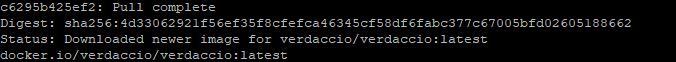
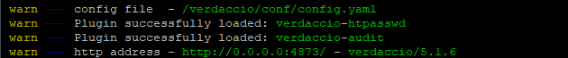
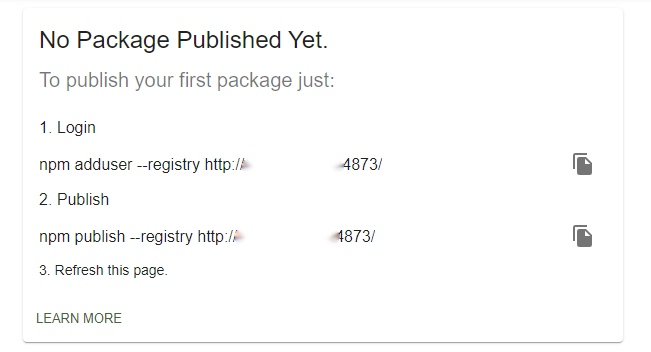

## 使用工具
我们平时使用npm publish进行发布的时候，上传的仓库默认npm，如果想要将仓库私有化怎么实现？这里可以使用Verdaccio工具在服务器或在本地上部署一个仓库地址，再把本地的默认上传仓库地址切换到本地仓库即可。当npm install没有在我们搭建的私有仓库中找到时，Verdaccio默认配置会再去npm中央仓库上下载
## 环境准备
1. 内部服务器（4核8G Centos7）
2. docker
3. docker-compose

## 使用docker安装verdaccio
1. 在docker下安装verdaccio镜像，在终端上输入以下命令：
   ```
   docker pull verdaccio/verdaccio
   ```
   安装镜像成功：
  
)

1. 运行 verdaccio，使用docker命令运行镜像，创建verdaccio容器
   ```
   // 名称为verdaccio的容器，端口为 4000
   docker run -it --name verdaccio -p 4000:4000 verdaccio/verdaccio
   ```
   容器启动成功：
   
   启动成功我们就可以通过 http://0.0.0.0:4000 访问仓库
2. 映射本地目录
   首先，创建 /home/verdaccio目录，以下在该目录下操作。
   其次，创建 conf目录，并添加verdaccio的config.yaml配置文件。
   接着处理映射目录，一般有以下两种方式：

   (1).直接映射本地目录，启动verdaccio
   -v: 容器目录映射到本地目录

   ```
   docker run -it --name verdaccio -p 4000:4000 -v /home/verdaccio/storage:/verdaccio/storage -v /home/verdaccio/conf:/verdaccio/conf -v /home/verdaccio/plugins:/verdaccio/plugins verdaccio/verdaccio

   ```
   
   (2).或者使用docker-compose启动
       添加 docker-compose.yml 文件，使用docker-compose up 命令启动

       ```
       
       version: '3'
       services:
         verdaccio:
           image: verdaccio/verdaccio
           container_name: "verdaccio"
           network--mode: "bridge"
           environment:
             - VERDACCIO_PORT=4873
           ports:
             - "4873:4873"
           volumes:
             - "/home/verdaccio/storage:/verdaccio/storage"
             - "/home/verdaccio/conf:/verdaccio/conf"
             - "/home/verdaccio/plugins:/verdaccio/plugins"
           network_mode: "bridge"

       ```

       注意： 本地目录 /home/verdaccio/storage 需要设置权限，不然会因为权限问题而导致操作失败。

       ```

       chown -R 10001:65533 /home/verdaccio/storage

       ```
       本地映射成功后，会简化很多操作，比如：在 /home/verdaccio目录下会创建 storage目录，如果发布了包，则在目录下的data中能找到对应的包的文件夹，可以查看所有上传的npm包，这里也可以直接删除想要删除的包；也会在conf映射到配置文件，方便我们需要时修改配置信息

4.拷贝 verdaccio 配置文件
如果不想做本地目录映射，也可以使用如下命令，拷贝出verdaccio镜像的配置文件。docker cp ：容器和本地系统之间，开背文件或文件夹
```
docker cp verdaccio:/verdaccio/conf/config.yaml /home
```

5.私有库部署成功
verdaccio安装成功后，就可以直接通过网络访问。当页面出现下图所示，就表示私有库搭建成功，后续就可以进行私有包的发布和下载


## 发布一个包
有了私有库以后，就可以发布包到私有库上，但是初始化的时候需要添加用户，设置用户名密码等，就可以直接发包了。
1. 添加用户
```
npm adduser --registry http://0.0.0.0:4000/
```
然后输入用户名密码
2. publish
   当需要把某个项目发布到私有库的时候，直接publish
   ```
   npm publish --registry http://0.0.0.0:4000
   ```
   发布成功后，刷新页面，就能开到新的包
3. install
   ```
   npm install --registry=http://0.0.0.0:4000
   ```

