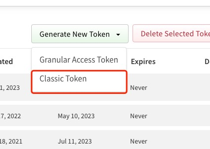
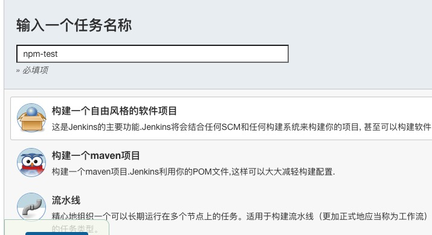
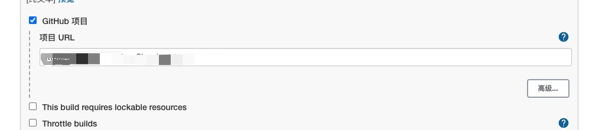
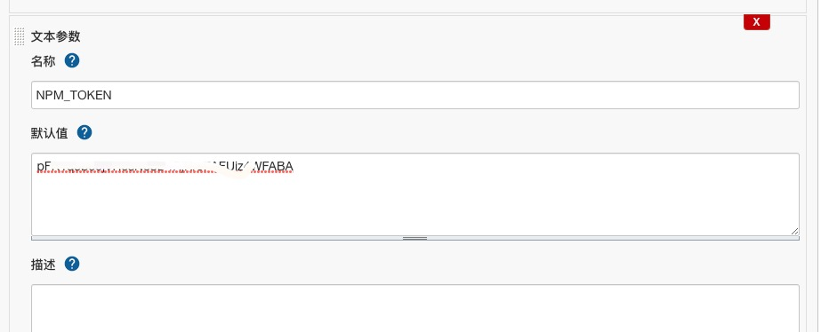
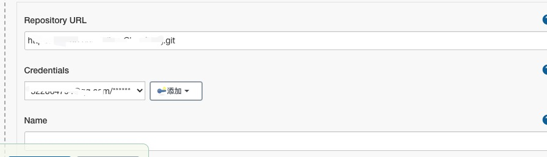
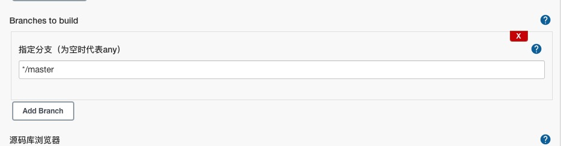
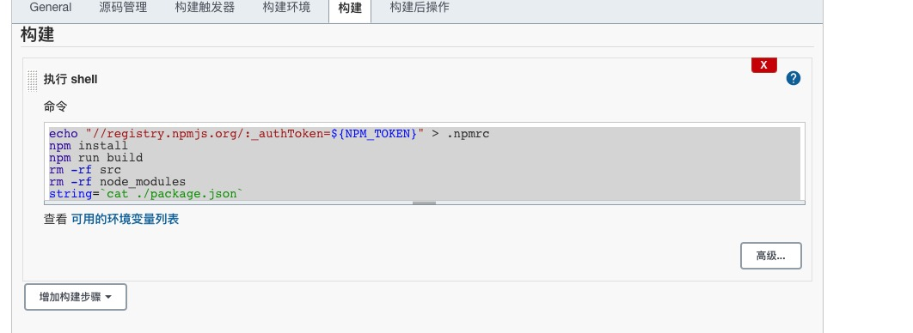

我们现在有越来越多的小伙伴不管是在业务上还是自己学习上都有创建工具库的需求，但是每次都需要手动进行npm publish的操作就感觉不太对。这里就记录了我在工作上通过jenkins + gitlab 自动化打包到公司私有库上的大致过程

## 前情提醒需要将gitlab和jenkins做个关联
   在 [Jenkins + Github自动化](./00.md) 一文中有详细讲解, 当然jenkins中需要安装的是gitlab插件


## 直入重点

### 生成 npm token 备用
   1. 登入到 npm 的官网，点击头像 进入到 `Access Tokens` 去 创建一个新的token，选择Classic Token
   
   2. 创建完token 后保存好备用，找到profile 打开 2FA


### 进入到jenkins中创建项目
   1. 点击jenkins创建项目
   
   2. 设置github项目url
   
   3. 设置环境变量，刚刚我们生成的npm token现在就派上用场了
   
   4. 设置与你的项目仓库对应的仓库地址，并且选择gitlab对应的凭证
   
   5. 设置需要监听的分支
    
   6. 接下来就是构建shell脚本啦
   

   shell脚本如下：
   ```
    # 将//registry.npmjs.org/:_authToken=${NPM_TOKEN} 写入 .npmrc中 ${}里面就是我们刚刚设置的环境变量
    echo "//registry.npmjs.org/:_authToken=${NPM_TOKEN}" > .npmrc
    npm install
    npm run build
    # src node_modules 不需要传到仓库里去 所以删掉
    rm -rf src
    rm -rf node_modules
    # 执行发布命令
    npm publish
   ```