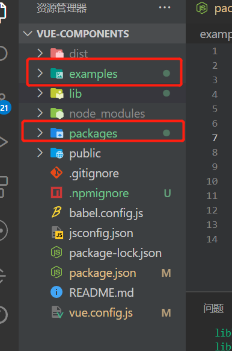
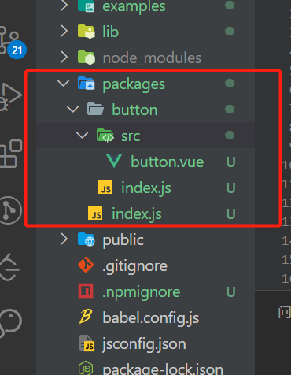

## 前言
现在市面上的各种UI组件库层出不穷，比如说 Element、iview 和 Antd 等等,它们可以满足我们绝大多数的需求。但是如果我们项目中出现了较为特别的需求时，这时候需要我们拥有自己的一套组件的时候，我们就需要开发属于自己的组件库了。

所以通过阅读本文，我们可以快速掌握如何搭建自己的组件库。

## 一、前置准备
- vue-cli
- npm: 最终组件库将放置于npm

## 二、大概思路
搭建一个组件库，我们需要有一个大概的思路
1. 确定项目目录结构
2. 编写组件
3. 编写示例
4. 配置库模式打包编译脚本
5. 本地测试组件库
6. 发布到npm

## 三、确定项目目录结构
### 1、创建项目
使用vue-cli 创建一个vue项目
```js
vue create vue-components
```

### 2、修改默认的目录结构
我们需要在根目录下面添加一个packages 和 将src目录修改为examples

```shell
...
├── packages (用来存放编写组件库带啊吗)
│     
├── examples (原 src 目录，将其改为examples,用于展示示例)
...
```

如下图所示


  

### 3、配置项目目录支持新的目录结构

 通过上一步，我们对目录结构进行了修改，那带来的问题显而易见，如下：

 - src 目录更名为examples，导致项目无法运行
 - 新增packages目录，该目录未加入webpack编译（我们可以在vue.config.js 中进行配置）

#### (1)、重新配置入口，修改配置中的pages选项

修改vue.config.js 的pages配置项，如下：

```js
module.exports = {
  pages: {
    index: {
      entry: 'examples/main.js',
      template: 'public/index.html',
      filename: 'index.html'
    }
  },
}
```

#### (2)、支持对 `packages` 目录的处理，修改配置中的 `chainWebpack` 选项

`packages` 是我们新增的一个目录，默认是不被webpack处理的，所以需要添加配置对该目录的支持。

`chainWebpack` 是一个函数，会接收一个基于 `webpack-chain` 的 `ChainableConfig` 实例。允许对内部的webpack配置进行更细粒度的修改。

```js
const { defineConfig } = require('@vue/cli-service')
module.exports = defineConfig({
  transpileDependencies: true,
  pages: {
    index: {
      entry: 'examples/main.js',
      template: 'public/index.html',
      filename: 'index.html'
    }
  },
  // 扩展 webpack 配置，使 packages 加入编译
  chainWebpack: config => {
    config.module
    .rule('js')
    .include
      .add('/packages')
      .end()
    .use('babel')
      .loader('babel-loader')
      .tap(options => {
        // 修改它的选项...
        return options
      })
  }
})

```
#### (3)、编写组件

1、在  `packages` 文件夹下创建一个组件文件夹，以button为例

2、在 `packages` 文件夹下创建一个index.js,用来暴露所有组件

3、在`button/`目录下创建一个src文件夹，用来存储组件源代码

4、在`button/`目录下创建index.js 文件对外提供组件的引用

  

5、 修改 `/package/button/index.js`文件，对外提供引用
```js
import ChenButton from './src/button.vue'

ChenButton.install = function (Vue) {
  Vue.component(ChenButton.name, ChenButton)
}

export default ChenButton
```

6、简单的写一下button代码，`/packages/button/src/index.js`

```js
<template>
  <div>
    小强button
  </div>
</template>

<script>
export default {
  name: 'ChenButton',
}
</script>

<style lang="scss" scoped>
</style>
```

7、整合所有组件，对外导出，一个完整的组件库
修改 `/packages/index.js`文件，对整个数据库进行导出
```js
// 导入颜色选择器组件
import chenButton from './button'

// 存储组件列表
const components = [
  chenButton
]

// 定义 install 方法，接收 Vue 作为参数。如果使用 use 注册插件，则所有的组件都将被注册
const install = function (Vue) {
  // 判断是否安装
  if (install.installed) return
  // 遍历注册全局组件
  components.map(component => Vue.component(component.name, component))
}

// 判断是否是直接引入文件
if (typeof window !== 'undefined' && window.Vue) {
  install(window.Vue)
}

export default {
  // 导出的对象必须具有 install，才能被 Vue.use() 方法安装
  install,
  // 以下是具体的组件列表
  chenButton
}
```

8、在examples 中导入组件库并且添加示例

修改`examples/main.js`

```js
import Vue from 'vue'
import App from './App.vue'

// 导入组件库
import ChenButton from '../packages/index'

Vue.use(ChenButton)

Vue.config.productionTip = false

new Vue({
  render: h => h(App),
}).$mount('#app')
```

在`examples/App.vue` 使用

```html
<template>
  <div id="app">
    <chen-button></chen-button>
  </div>
</template>
```

9、在  `package.json` 中新增一条编译的脚本命令，在scripts中添加一条命令 `npm run lib`, 并执行
```shell
"scripts": {
	"lib": "vue-cli-service build --target lib --name vuecomponents --dest lib packages/index.js"
}
```

10、配置 package.json 文件中发布到npm的字段
- `name`: 包名，该名字是唯一的。可在npm官网收索名字
- `version`: 版本号，每次发布至npm需要修改版本号，不能和历史版本一样
- `description`: 描述
- `main`: 入口文件，该字段需要指向我们最终编译后的文件
- `keyword`: 关键词，以空格分离希望用户搜索的词
- `author`: 作者
- `private`: 是否私有，需要修改为false 才能发布到npm
- `license`: 开源协议
  
```js
{
  "name": "vue-components",
  "version": "0.1.0",
  "description": "test vue components",
  "main": "lib/vuecomponents.umd.min.js",
  "keyword": "chen vue components",
  "private": false,
}
```

11、 添加 `.npmignore` 文件，设置忽略发布的文件

其实我们需要发布到npm上的文件 只有 `lib` 这个目录，`package.json` 和 README.md。所以我们需要设置忽略的目录和文件

```js
# 忽略目录
examples/
packages/
public/

# 忽略指定文件
vue.config.js
babel.config.js
*.map
```

## 四、本地测试组件库是否好用
### 1. 在组件库根目录下进行以下操作
(1). 首先执行 `npm run lib` 
(2). 执行 `npm link`

### 2. 进入需要使用组件库的项目的根目录下，进行如下操作
(1). 到 `package.json` 中设置 `dependencies`，如下：
```js
{
  "dependencies": {
    "vue-components": "0.1.0"
  }
}
```
(2). 打开终端 执行 `npm link vue-components`

(3). 到 `src/main.js` 引入组件库
```js
import ChenButton from 'vue-components'
Vue.use(ChenButton)
```

## 五、本地测试没问题后可以准备发布到npm上

1. 首先需要有一个npm账号，没有的话可到官网上去注册
   
2. 如果有设置了淘宝镜像，先设置回npm镜像：
```js
npm config set registry http://registry.npmjs.org 
```

3. 然后在终端执行登录命令，输入用户名、密码邮箱即可登录

```shell
npm login
```

4. 发布到npm上
```shell
npm publish
```

5. 发布成功后就可以向使用其他第三方库一样使用 npm install vue-components -S 来安装依赖了


