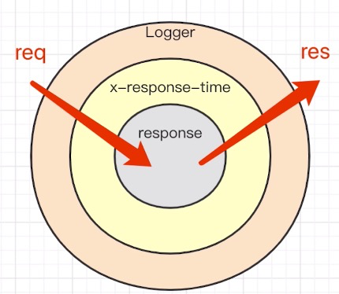

## kOA 原理分析

我们知道 koa 是通过 app.use 来对中间件进行注册的，先收集起来。并且中间件的执行是通过next来执行的，即上一个中间件触发next(),下一个中间件开始执行。（注意koa不涉及method和path的判断，koa本身没有router需要借助koa-router）

### 上代码
```js
// compose 方法为将中间件赋值next方法
function compose (middlewareList) {
  return function (ctx) {
      function dispatch (i) {
         let fn = middlewareList[i]
         try {
             return Promise.resolve(fn(ctx, dispatch.bind(null, i+1)))
         } catch (e) {
             return Promise.reject(e)
         }
      }
      return dispatch(0)
  }
}

class MyKoa {
    constructor () {
       this.middlewareList = []
    }
    // 中间间收集
    use (middleware) {
      this.middlewareList.push(middleware)
    }
    createCtx (res, req) {
        return {
            res,
            req
        }
    }
    callback () {
        const fn = compose(this.middlewareList)
        return function (res, req) {
            // 合并 res和req
            const ctx = this.createCtx(res, req)
            return fn(ctx)
        }
    }
    listen (...arg) {
       const server = http.createServer(this.callback())
       server.listen(...arg)
    }
}
```

## 洋葱圈模型
看完 koa中间件的简单实现，我们再来看洋葱圈模型就会豁然开朗了。看一下下面官网提供的简单的例子：

```js
const Koa = require('koa');
const app = new Koa();

// logger
app.use(async (ctx, next) => {
  console.log('第一层洋葱 - 开始')
  await next();
  const rt = ctx.response.get('X-Response-Time');
  console.log(`${ctx.method} ${ctx.url} - ${rt}`);
  console.log('第一层洋葱 - 结束')
});

// x-response-time
app.use(async (ctx, next) => {
  console.log('第二层洋葱 - 开始')
  const start = Date.now();
  await next();
  const ms = Date.now() - start;
  ctx.set('X-Response-Time', `${ms}ms`);
  console.log('第二层洋葱 - 结束')
});

// response
app.use(async ctx => {
  console.log('第三层洋葱 - 开始')
  ctx.body = 'Hello World';
  console.log('第三层洋葱 - 结束')
});

app.listen(8000);
```
执行顺序如下：
```
第一层洋葱 - 开始
第二层洋葱 - 开始
第三层洋葱 - 开始
第三层洋葱 - 结束
第二层洋葱 - 结束
第一层洋葱 - 结束
```
这就是洋葱模型，用来表示koa的执行顺序的模型，用图片表示如下：

