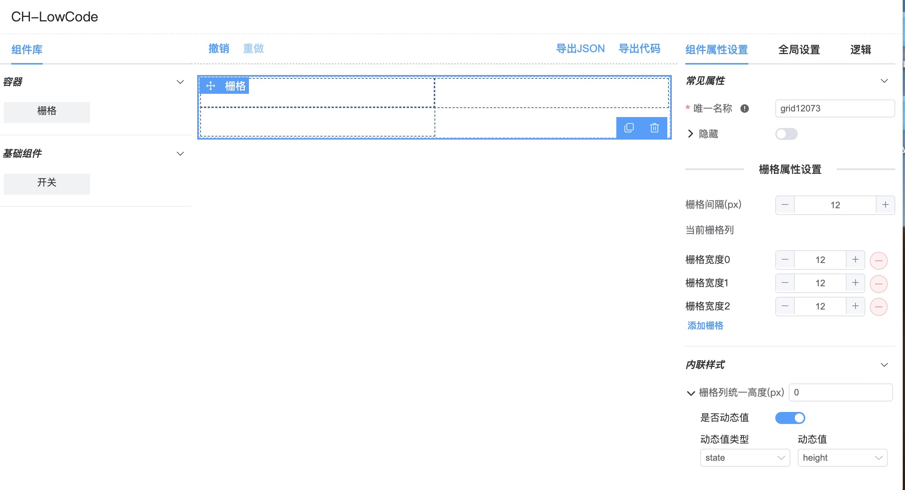

# 低代码
低代码是什么？开发者主要通过图形化界面和配置来创建页面，而不用通过传统模式用手写代码。低代码模式下的开发者，通常不用具备非常专业的编码技能，或者不需要某一专业领域的编码技能，通过低代码平台就能实现专业代码的产出。

## 简易版的低代码平台
实现简易的低代码我们可以通过一个json数据来描述一块区域或者是一个组件或元素，如下：
```
 {
    type: 'grid',
    name: '栅格',
    category: 'container',
    elementName: 'el-row',
    semanticType: 'el-row',
    icon: 'grid',
    cols: [],
    style: {
      height: {
        value: 0,
        isDynamic: false,
        referenceType: '',
        id: ''
      }
    },
    options: {
      name: '',
      hidden: {
        value: false,
        isDynamic: false,
        referenceType: '',
        id: ''
      },
      gutter: 12,
      // colHeight: 0, // 栅格列同一高度属性，用于解决栅格列设置响应式布局浮动后被挂住的问题
      customClass: '' // 自定义类css类名
    }
  },
```
这个json也是低代码平台搭建中最核心的部分，它在后续的可视化拖拽页面中扮演这重要的角色，它是页面设计和页面渲染之间串联的纽带。

##页面设计器
低代码平台都是通过拖拽可视化的页面设计器进行页面开发的，我们可以看一下低代码平台的页面分布，如下：


可以看到，低代码平台包含了如下所示几个区域：
* 最上方的是操作栏，可以对页面进行会退，重做，导出json，导出代码操作。
* 左侧是 组件列表，当然也可以添加一些切换，页面树信息等等功能
* 中间是 画布 区域，我们可以讲组件拖到画布中，当然也可以在画布中对组件进行拖拽和删除
* 右侧 属性配置区域，当我们在画布中选择组件时，我们可以在右侧的属性配置配置当前组件属性值（支持动态属性配置）和 在使用动态属性的时候需要在逻辑栏中配置state和props，逻辑中还可以补充声明周期的函数

## 组件列表
首先，我们看一下左侧的组件列表，列表中的每一项组件，我们都需要使用一段json来描述，这段json我们可以把它称为元数据，元数据描述了当前组件的名称、中文名称、类型等属性。已switch组件为例，它的元数据如下：
```
{
    type: 'switch',
    name: '开关',
    icon: 'switch-field',
    elementName: 'el-switch',
    semanticType: 'Switch',
    options: {
      name: '',
      label: '',
      defaultValue: {
        value: false,
        isDup: false,
        isDynamic: false,
        referenceType: '',
        id: ''
      },
      columnWidth: '200px',
      labelWidth: {
        value: 0,
        isDynamic: false,
        referenceType: '',
        id: ''
      },
      labelHidden: {
        value: false,
        isDynamic: false,
        referenceType: '',
        id: ''
      },
      disabled: {
        value: false,
        isDynamic: false,
        referenceType: '',
        id: ''
      },
      hidden: {
        value: false,
        isDynamic: false,
        referenceType: '',
        id: ''
      },
      //------------------
      customClass: '',
      labelIconClass: '',
      labelIconPosition: 'rear',
      labelTooltip: '',
      switchWidth: {
        value: 30,
        isDynamic: false,
        referenceType: '',
        id: ''
      },
      activeText: {
        value: '',
        isDynamic: false,
        referenceType: '',
        id: ''
      },
      inactiveText: {
        value: '',
        isDynamic: false,
        referenceType: '',
        id: ''
      },
      activeColor: {
        value: '',
        isDynamic: false,
        referenceType: '',
        id: ''
      },
      inactiveColor: {
        value: '',
        isDynamic: false,
        referenceType: '',
        id: ''
      },
      //-------------------- 事件
      onChange: '',
      //-------------------- 方法
      onFocus: ''
    }
  }
```
所以左侧的组件列表实际上就是通过一个个这样的元数据组成的数组遍历出来的。

## 拖动
左侧组件栏已经实现，接下来我们就需要看一下组件列表要怎么拖到画布中。这里我采用的是顺序拖动的方式。拖动插件方面我选择的是vuedraggable插件。现在直接上项目中的拖动代码主要逻辑，如下：

#### 侧边栏组件列表拖拽逻辑（widget-pannel）
```
<template>
  <el-collapse v-model="activeNames" class="widget-collapse">
            <el-collapse-item name="1" title="容器">
              <vue-draggable
                tag="ul"
                v-model="containers"
                item-key="key"
                :group="{ name: 'component', pull: 'clone', put: false }"
                :clone="handleContainerWidgetClone"
                ghost-class="ghost"
                :sort="false"
                :move="checkContainerMove"
                @end="onContainerDragEnd"
              >
                <template #item="{ element: ctn }">
                  <li class="container-widget-item" :key="ctn.name" :title="ctn.displayName">
                    <span>
                      {{ ctn.name }}
                    </span>
                  </li>
                </template>
              </vue-draggable>
            </el-collapse-item>
            <el-collapse-item name="2" title="基础组件">
              <vue-draggable
                tag="ul"
                v-model="basicFields"
                item-key="key"
                :group="{ name: 'component', pull: 'clone', put: false }"
                ghost-class="ghost"
                :sort="false"
                :clone="handleFieldWidgetClone"
                :move="checkFieldMove"
              >
                <template #item="{ element: fld }">
                  <li class="field-widget-item" :key="fld.name" :title="fld.displayName">
                    <span>
                      {{ fld.name }}
                    </span>
                  </li>
                </template>
              </vue-draggable>
            </el-collapse-item>
          </el-collapse>
</template>
```
checkContainerMove 方法中逻辑为检测拖动到的位置是否为Container组件，容器组件中不能再拖入容器。相同的 基础组件 模块也有一个checkFieldMove 的逻辑为拖入的目标点是否是 'sub-form-table' 和 'slot' 组件 如果是则拖拽失败。这两个方法都返回一个Boolean值。如果false拖拽失败，true拖拽成功。

接下来就是 handleFieldWidgetClone 和 handleContainerWidgetClone这两个克隆方法。对克隆数据进行加工，具体逻辑为对组件列表拖拽过来的元数据进行深拷贝，对拷贝过后的元数据进行唯一id的定义，数据初始化等等。不同的组件类型可以根据需求加过。加工完后返回 新的元数据。

拖拽组的group属性中的name一定要保持一致。

#### 画布区域的拖拽（widget-pannel）
```
<div class="form-widget-list">
        <vue-draggable
          :list="designer.widgetList"
          item-key="id"
          v-bind="{
            animation: 250,
            group: 'component',
            disabled: false,
            ghostClass: 'ghost'
          }"
          tag="transition-group"
          handle=".drag-handler"
          @end="onDragEnd"
          @add="onDragAdd"
          @update="onDragUpdate"
          :move="checkMove"
        >
          <template #item="{ element: widget, index }">
            <div class="transition-group-el" :key="index">
              <template v-if="'container' === widget.category">
                <component
                  :is="getWidgetName(widget)"
                  :widget="widget"
                  :designer="designer"
                  :parent-list="designer.widgetList"
                  :index-of-parent-list="index"
                  :parent-widget="null"
                />
              </template>
              <template v-else>
                <component
                  :is="getWidgetName(widget)"
                  :field="widget"
                  :designer="designer"
                  :parent-list="designer.widgetList"
                  :index-of-parent-list="index"
                  :parent-widget="null"
                />
              </template>
            </div>
          </template>
        </vue-draggable>
      </div>
```
目标地的拖拽逻辑需要绑定 designer.widgetList 的一个数组变量，拖拽成功后会往这个数组中push刚刚我们clone的数据。

接下来分析一下 onDragAdd 逻辑做了啥，当拖拽成功后将当前的拖拽元素形成一个选中的高亮状态。

onDragUpdate 当拖拽元素更新后将当前的 widgetList（画布元素列表）数据进行缓存用于撤销和重做。

#### 嵌套组件
目前，组件拖动到画布已经实现。那么组件内是否可以再继续拖入组件呢？答案是可以的，通过看了一些低代码产品，他们组件列表都是分类显示的，有布局类组件（容器，栅格组件，卡片组件等）、普通组件。布局类组件就可以将非容器组件继续拖入到其中。话说回来，为了让组件支持嵌套组件的功能，我们需要在元数据上添加一个属性，用这个属性来描述组件下嵌套了什么组件，我们把这个属性命名为widgetList。元数据结构如下：
```
 {
    type: 'grid-col',
    name: '栅格列',
    category: 'container',
    elementName: 'el-col',
    semanticType: 'Col',
    icon: 'grid-col',
    internal: true,
    widgetList: [],
    options: {
      // ...col相关配置属性
    }
  }
```
为了满足嵌套组件的需求，我们还需要做如下操作：
1、在布局类组件中继续引入拖入组件。进入到我们项目中的grid-col组件中再次引入vuedraggable组件，组件list参数值为元数据的widgetList数组，然后在vuedraggable组件内部使用插槽将widgetList进行渲染。具体实现如下：
```
<vue-draggable
      :list="widget.widgetList"
      item-key="id"
      v-bind="{ group: 'component', ghostClass: 'ghost', animation: 200 }"
      tag="transition-group"
      :component-data="{ name: 'fade' }"
      handle=".drag-handler"
      @add="onGridDragAdd($event, widget, widgetList)"
      @end="onGridDragEnd($event, widget, widgetList)"
      @update="onGridDragUpdate"
      :move="checkContainerMove"
    >
      <template #item="{ element: subWidget, index: swIdx }">
        <div class="form-widget-list">
          <template v-if="'container' === subWidget.category">
            <component
              :is="subWidget.type + '-widget'"
              :widget="subWidget"
              :designer="designer"
              :key="subWidget.id"
              :parent-list="widget.widgetList"
              :index-of-parent-list="swIdx"
              :parent-widget="widget"
            ></component>
          </template>
          <template v-else>
            <component
              :is="subWidget.type + '-widget'"
              :field="subWidget"
              :designer="designer"
              :key="subWidget.id"
              :parent-list="widget.widgetList"
              :index-of-parent-list="swIdx"
              :parent-widget="widget"
              :design-state="true"
            ></component>
          </template>
        </div>
      </template>
    </vue-draggable>
```
可以看到`<vue-draggable>`标签内我用component来动态遍历widgetList，从而可以实现组件的嵌套显示。

## 属性的配置区域
现在就要说到右侧的配置区域了。原理非常简单。我们可以为画布区域的组件添加一个点击事件，当点击某一个组件的时候，我们可以获取到当前组件对应的元数据，我先前已经在元数据中维护了一个options属性，这个属性就能够动态的控制参数了。

#### 具体实现
##### 一、首先我会维护一个属性注册表propertyRegister.js,内容如下：
```
const COMMON_PROPERTIES = {
 'name': 'name-editor',
 'label': 'label-editor',
 'labelAlign': 'labelAlign-editor',
 'defaultValue': 'defaultValue-editor',
 'colHeight': 'colHeight-editor',
 'columnWidth': 'columnWidth-editor',
 'labelWidth': 'labelWidth-editor',
 'labelHidden': 'labelHidden-editor',
 'hidden': 'hidden-editor',
 'disabled': 'disabled-editor',
 // 容器
 'gutter': 'gutter-editor'
}

const ADVANCED_PROPERTIES = {
 'switchWidth': 'switchWidth-editor',
 'activeText': 'activeText-editor',
 'inactiveText': 'inactiveText-editor',
 'activeColor': 'activeColor-editor',
 'inactiveColor': 'inactiveColor-editor'
}

const STYLE_PROPERTIES = {
 'height': 'height-editor'
}

/**
 * 判断属性是否已经注册
 * @param uniquePropName 属性名称（保证名称唯一，不跟其他组件属性冲突）
 */
export function propertyRegistered (uniquePropName) {
 return !!COMMON_PROPERTIES[uniquePropName]
}
export default {
 COMMON_PROPERTIES,
 ADVANCED_PROPERTIES,
 STYLE_PROPERTIES
}
```
可以看到key值对应的其实和我们在元数据中定义的options中的key值是一一对应的，而对应的属性值是该属性对应的编辑组件名。COMMON_PROPERTIES中维护的是一些常规属性，ADVANCED_PROPERTIES维护的是一些高级属性，STYLE_PROPERTIES可以用于维护一些常用的样式属性。

##### 二、获取到propertyRegister.js的属性注册表，使用属性遍历出对应组件，以常用属性为例，代码如下：
```
<template v-for="(editorName, propName) in commonProps" :key="propName">
                    <component
                      v-if="hasPropEditor(propName, editorName)"
                      :is="getPropEditor(propName, editorName)"
                      :optionModel="optionModel"
                      @change="selectedWidgetChange"
                      :designer="designer"
                      :selected-widget="selectedWidget"
                    ></component>
</template>
```
hasPropEditor 是用来判断该选中的组件元数据中的options是否有存在于commonProps中，如果存在就展示，如果未存在不展示。以此就能实现展示与组件options一一对应的属性修改组件。

getPropEditor 是用来获取属性修改组件的组件名称。

##### 三、在实际项目当中我们会有在属性上设置动态值的需求
这时候我们就需要在元数据中对需要设置动态值的属性进行如下修改：
```
{
    type: 'switch',
    name: '开关',
    icon: 'switch-field',
    formItemFlag: true,
    elementName: 'el-switch',
    semanticType: 'Switch',
    options: {
      name: '',
      label: '',
      // labelAlign: {
      //   value: 'label-left-align'
      // },
      defaultValue: {
        value: false,
        isDup: false,
        isDynamic: false,
        referenceType: '',
        id: ''
      },
      columnWidth: '200px',
      labelWidth: {
        value: 0,
        isDynamic: false,
        referenceType: '',
        id: ''
      },
      labelHidden: {
        value: false,
        isDynamic: false,
        referenceType: '',
        id: ''
      },
      disabled: {
        value: false,
        isDynamic: false,
        referenceType: '',
        id: ''
      },
      hidden: {
        value: false,
        isDynamic: false,
        referenceType: '',
        id: ''
      },
      //------------------
      customClass: '',
      labelIconClass: '',
      labelIconPosition: 'rear',
      labelTooltip: '',
      switchWidth: {
        value: 30,
        isDynamic: false,
        referenceType: '',
        id: ''
      },
      activeText: {
        value: '',
        isDynamic: false,
        referenceType: '',
        id: ''
      },
      inactiveText: {
        value: '',
        isDynamic: false,
        referenceType: '',
        id: ''
      },
      activeColor: {
        value: '',
        isDynamic: false,
        referenceType: '',
        id: ''
      },
      inactiveColor: {
        value: '',
        isDynamic: false,
        referenceType: '',
        id: ''
      },
      //-------------------- 事件
      onChange: '',
      //-------------------- 方法
      onFocus: ''
    }
  }
```
可以看到options中的属性我添加了
```
{
  value: 0,
  isDynamic: false,
  referenceType: '',
  id: ''
}
```
动态属性相关的配置项属性。

