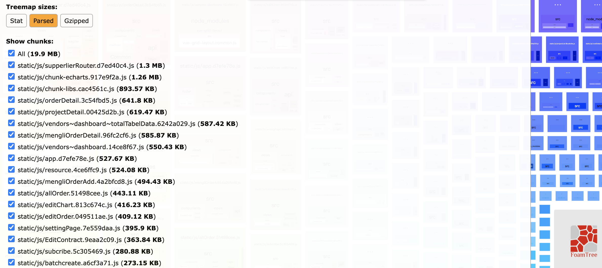
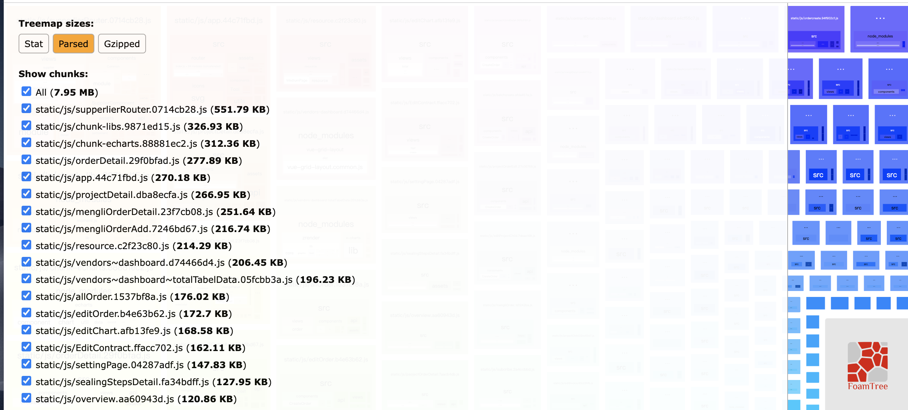

我们从输入 URL 到显示页面这个过程中，涉及到网络层面的，有三个主要过程：

* DNS 解析
* TCP 连接
* HTTP 请求/响应

对于DNS解析和TCP连接这两个步骤，我们前端可以做的努力非常的有限。相比之下，HTTP 连接这一层面的优化才是我们网络优化的核心。

HTTP优化有两个大方向：

* 减少请求次数
* 减少单次请求所花费的时间

这两个优化点直直地指向了我们日常开发中非常常见的操作——资源的压缩与合并。那么我在开发的时候使用的是webpack，我们就从webpack下手：

## 开始优化

首先开始优化前需要使用到 webpack-bundle-analyzer 这个非常非常好用的包组成可视化工具。它会以矩形树图的形式将包内各个模块的大小和依赖关系呈现出来。

首先我们在进行打包优化时候我们先做好一下几点的优化：

* 路由懒加载
* 异步组件

### 第一步

通过 bundle-analyzer的分析 我们可以看到 app.js的style.scss的体积达到了900kb，这是有点大的，所以去源码里面定位发现 多次的引入`import '../src/styles/element-variables.scss` 进行删除后节约了 500kb

### 第二步，externals 提取项目依赖

从打包分析中可以看到chunk-vendors.js中 vue,vue-router,vuex,element-ui,axios,echarts,v-charts 占据了一定体积，而这些依赖都是比较稳定的不常修改的公共依赖包。所以我们可以把这些依赖包提取出来。这里把ElementUI也提取出来没用按需加载是因为项目中使用到的elment范围很广按需加载优化力度不大，所以直接提取出来。

注意：项目中引用到这些依赖的全都换成require引入！！

webpack 添加一下配置

```
externals: {
  'vue': 'Vue',
  'vue-router': 'VueRouter',
  'vuex': 'Vuex',
  'element-ui': 'ELEMENT',
  'axios': 'axios',
  'echarts': 'echarts',
  'v-charts': 'VeChart'
},
```

在index.html 中引入CDN：

```
  <script src="https://lib.baomitu.com/vue/2.7.6/vue.min.js"></script>
    <script src="https://lib.baomitu.com/vue-router/3.5.1/vue-router.min.js"></script>
    <script src="https://lib.baomitu.com/axios/1.2.1/axios.min.js"></script>
    <script src="https://lib.baomitu.com/vuex/3.6.2/vuex.min.js"></script>
    <script src="https://lib.baomitu.com/element-ui/2.15.13/index.js"></script>
    <script src="https://cdn.jsdelivr.net/npm/echarts/dist/echarts.min.js"></script>
  <script src="https://cdn.jsdelivr.net/npm/v-charts/lib/index.min.js"></script>
  <link rel="stylesheet" href="https://cdn.jsdelivr.net/npm/v-charts/lib/style.min.css">
```

### 第三步，减小三方依赖的体积

1. 项目中用到moment.js 但是里面有一大部分的语言包没有用到，所以我们需要剔除掉这些语言包的打包，方法如下：

使用 moment-locales-webpack-plugin 插件，剔除掉无用的语言包

安装：
```
npm install moment-locales-webpack-plugin -D
```

使用：
```
const MomentLocalesPlugin = require('moment-locales-webpack-plugin');

module.exports = {
  configureWebpack: {
     plugins: [
       new MomentLocalesPlugin({localesToKeep: ['zh-cn']})
     ]
  }
}
```

2. 项目中还用到了 lodash，但是项目中前端小伙伴们全部通过`import _ from 'lodash'`的方式引入，这样一来lodash的方法会被全部打包的。所以我逐个进行了具体引入如下：
```
import cloneDeep from 'lodash/cloneDeep'
```
通过以上的操作又节约了 400KB


重新打包，最新数据如下：

打包后的体积：
 

 可以看到打包体积由原来的25MB 变为了 19MB, 效果还是非常可观的

 ### 第四步 压缩js

 从分析报告中可以看出来，项目中的源码也占据了很多体积很多个chunk都是几百KB，这边我看出来了webpack没有配置js压缩，这可是个大头：

 所以我加上了 `terser-webpack-plugin` 进行压缩js

 在配置项中引入：

 ```
 optimization: {
  minimizer: [
   new TerserPlugin({
      test: /\.js(\?.*)?$/i,
      parallel: true
    }),
  ]
 }
 ```
接下来重新打包：



打包体积直接从 19MB 到 7.5MB 了，可谓是质的飞跃。
