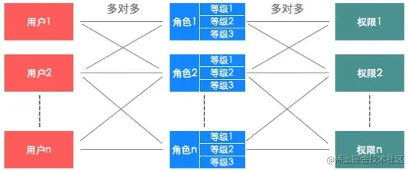
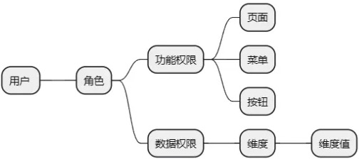
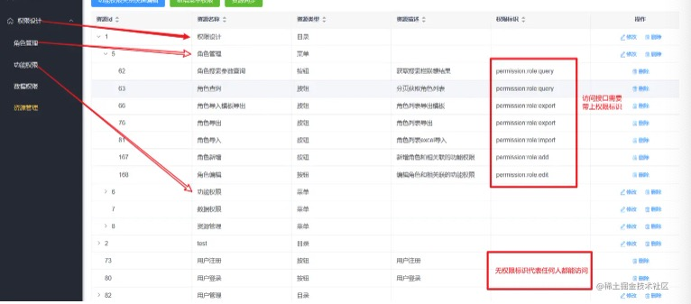
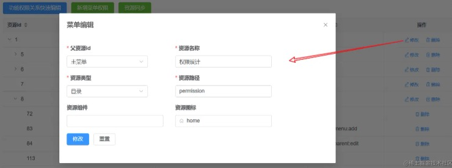
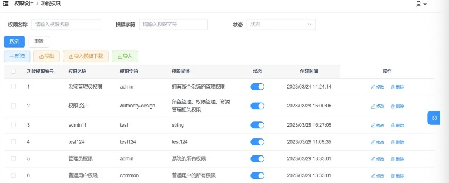
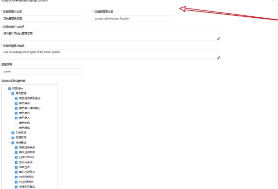
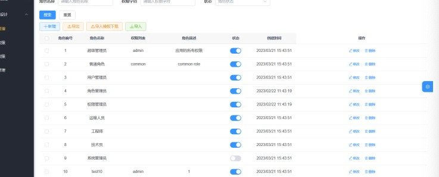

日常工作中因为老和后台管理系统打交道，所以当然不可避免的会遇到权限控制的场景。这里针对在项目中所做的权限控制方案进行一个记录

## 权限模型
 项目中用到的权限模型是 RBAC权限模型，RBAC权限模型有三个基础的组成部分，分别是：用户、角色和权限：
 * 用户：可以是单个用户，也可以是用户组
 * 角色：可以定义为单个角色，也可以将同类型的角色做成角色集，上下级的角色定义为岗位
 * 权限：可以分为两大类：功能权限和数据权限。功能权限是指菜单（页面），按钮（api）等这类权限。数据权限是指对数据访问范围的区分，如根据国家区分数据的访问范围。

 RBAC三个部分的关系图如下：
 

 结合了RBAC的想法，用户、角色、权限中的权限我们在实际开发中可以拆分为 功能权限和数据权限。

 * 功能权限：指的是页面，菜单栏，按钮这类能够被操作的权限
 * 数据权限：指的是数据的访问范围。

 所以结合RBAC和权限设计，一个简单的权限模型设计如下：

 

## 实现的页面如下

1. 资源管理页面
    
    该页面就是用来配置功能的功能权限 页面、菜单、按钮（API）访问，这里称为资源。

    对于页面和菜单增改操作，点击按钮激活弹窗进行编辑调用接口将设置后的数据保存到数据库，删除则直接调用接口。
    

    资源的字段设计如下：
    ```
    resource_id: 资源id
    resource_name: 资源名称
    resource_type: 资源类型（M：目录 C：菜单 F：按钮）
    path: 前端表示路由地址，后端表示url
    component 前端组件路径
    perms：权限标识
    ```

2. 功能权限配置页
   
  一个功能权限可以对应多个资源，功能权限表的设计：
  ```
  function_id: 功能权限id
  resource_ids: 资源id组
  ```
  通关resource_ids 功能权限可以和资源关联起来。

  功能权限页面如下：
  

  点击修改按钮就可以重新配置功能权限，此时得到的功能权限列表为按钮和菜单相关联的权限树
  

3. 角色管理页面

   而一个角色可以对应多个权限功能，角色管理的表设计如下：
   ```
   role_id: 角色id
   role_name: 角色名称
   function_ids: 关联的权限列表
   ```

   角色管理列表页面如下：
   

   角色修改和新增也是修改和功能权限的关联性
   

   再此，角色和资源都有了。我们就可以和用户关联起来 一个用户可以对应多个角色。那么改用户的权限就是所有角色拥有的资源集合。

   ## 前端权限控制的实现

   前端权限控制有以下几个步骤：
     1. 登录后请求接口获取用户信息，里面就包括该用户所拥有的资源列表有 M（目录）C（菜单）和F（按钮）还包括一个权限资源id集合 permissions
     2. 通过 对资源树的遍历可以拿到 permissions 权限标识集合，用户组件级权限控制。去除资源树的F（按钮）我们可以得到侧边栏的菜单数据menuList。对菜单进行打平我们可以得到一个routes
     3. 通过 router.addRoute 方法将路由表加入到 routes中
     4. 我们有 permissions 就可以通过指令的形式进行组件级的权限控制
     5. 根据 menuList 我们可以生成侧边栏

     ```
     // 路由守卫逻辑
     router.beforeEach(async (to, from, next) => {
        if (getToken()) {
          // 登陆后，直接放行
          // 设置当前用户的信息，包括姓名，头像，角色，权限信息
          await setUserInfoAction();
          // 设置当前用户的左侧菜单
          await generateMenusAction(userState.permissions);
          // 根据菜单栏生成路由
          generateRoutes(usePermissionState.rolesRoutes);
          // 解决使用动态路由地址直接访问，或者刷新页面导致无法找到路由的问题 No match found
          if (to.path == '/404' && to.redirectedFrom != undefined) {
              if (router.getRoutes().find(item => item.path === to.redirectedFrom?.path)) {
                  next({ path: to.redirectedFrom?.fullPath, replace: true })
              } else {
                  next('/notFound')
              }
          } else {
              next()
          }
        } else {
            // 登陆后token过期,路由地址是白名单直接放行
            if (whiteList.includes(to.path)) {
                next();
                // next({ path: to.path, query: { redirect: to.fullPath } });
            } else {
                // 登陆后token过期，跳转到首页，query 放入当前路由的path
                if (to.path == '/404' && to.redirectedFrom != undefined) {
                    next({ path: "/login", query: { redirect: to.redirectedFrom?.fullPath } });
                } else {
                    next({ path: "/login", query: { redirect: to.fullPath } });
                }
            }
        }
    });
     function generateRoutes(menusPath: Resource[]) {
    menusPath.length > 0 && menusPath.forEach(menu => {
        router.addRoute("index", {
            path: `/${menu.path}`,
            name: menu.path,
            // component: () => import(`@/views/${menu.component}.vue`)
            component:
                //需要用vite规定的导入方式导入,否则打包后部署到服务器报错找不到动态导入的文件,
                //对应上方的const modules = import.meta.glob("../views/**/**.vue")
                //使用/* @vite-ignore */则不会在开发是报错
                modules[/* @vite-ignore */`../views/${menu.component}.vue`],
        })
    })
     ```

     组件级权限控制：
     ```
     <template>
        <!-- Admin can see this -->
        <el-tag v-permission="['admin']">admin</el-tag>

        <!-- Editor can see this -->
        <el-tag v-permission="['editor']">editor</el-tag>

        <!-- Editor can see this -->
        <el-tag v-permission="['admin','editor']">Both admin or editor can see this</el-tag>
      </template>

      <script>
        // 当然你也可以为了方便使用，将它注册到全局
        import permission from '@/directive/permission/index.js' // 权限判断指令
        export default{
          directives: { permission }
        }
      </script>
     ```

     v-permission指令的实现
     ```
         unction checkPermission(el, binding) {
         const { value } = binding
         const roles = store.getters && store.getters.roles

         if (value && value instanceof Array) {
           if (value.length > 0) {
             const permissionRoles = value

             const hasPermission = roles.some(role => {
               return permissionRoles.includes(role)
             })

             if (!hasPermission) {
               el.parentNode && el.parentNode.removeChild(el)
             }
           }
         } else {
           throw new Error(`need roles! Like v-permission="['admin','editor']"`)
         }
       }

       export default {
         inserted(el, binding) {
           checkPermission(el, binding)
         },
         update(el, binding) {
           checkPermission(el, binding)
         }
       }
     ```

   

   
   


